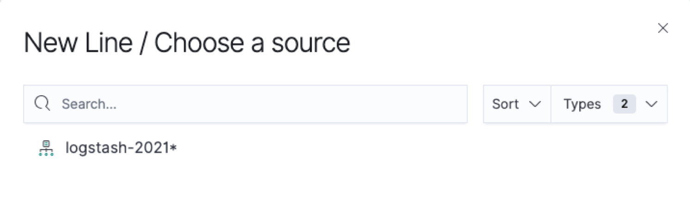

# BI 功能调研

## 概览

为了满足对大量网络指标的自定义需要，实现内部的自助 BI 产品，对一些 BI 产品做一些竞品分析。

- [Superset](https://superset.apache.org/)
- [Kibana](https://github.com/elastic/kibana)
- [横石 SENSE](https://www.hengshi.com/)
- [ExtraHop](https://www.extrahop.com/)

## Kibana

### 功能特性

- 选择图表类型（18 种）
- 单数据源
- 查看字段
- 设置指标
- 设置 X、Y 轴
- 简单的图表展示配置

### 流程简介

- New Visualization

- Choose a source

- Create

### 页面截图

## ExtraHop

### 功能特性

- 多数据源
- 选择图表类型（14 种）
- 设置指标
- 简单的图表展示配置

### 流程简介

无

### 页面截图

## Superset

### 功能特性

- 单数据源
- 选择图表类型（47 种）
- 设置指标
- 支持字段的计算
- 图表样式配置

#### Dashboard 配置

- 手动刷新
- 设置定时刷新时间
- 设置权限
- 主题配色

### 流程简介

界面 UI => JSON Scheme => 查询 SQL

- Chart UI

- JSON Scheme

- SQL

### 页面截图

## 横石 SENSE

### 功能特性

- 多数据源（join、union）
- 选择图表类型（59 种）
- 设置指标
- 支持字段的计算
- 图表样式配置
- 高级仪表盘
- 交互（自动刷新、下钻）

#### 数据集

> https://api.hengshi.com/latest/dataset.html

> 1.1.1. 数据集定义
> 数据集是结构化的数据的集合，对外展示的形式是一张数据表。根据数据集数据的来源，数据集可以分成数据连接，SQL 查询，多表联合，数据聚合，数据合并等种类。其中，数据连接 类型的数据集的数据来自某个数据源中的某张数据表；SQL 查询类型的数据集的数据来自某个数据源中的 SQL 语句查询生成的结果；多表联合类型的数据集的数据来自已经存在的两个或两个以上的数据集通过字段连接（join）生成的结果；数据聚合 类型的数据集的数据来自已经存在的一个数据集通过字段分组聚合生成的结果；数据合并类型的数据集的数据来自已经存在的两个或两个以上的数据集通过字段对齐后的行合并（union）生成的结果；

#### 度量

#### 过滤器

#### SQL 代码

#### 高级仪表盘

## 总结

web 界面 => JSON => 查询 SQL

## 准备实现的自助 BI

### Widget

- 单数据源
- 查看字段
- 支持选择 Chart 类型（先能 cover 住 NPMD 中现有的图表即可）
- X/Y 轴指定指标（即维度、度量。支持 1 个 Y 轴）
- 数字展示格式可配置（带宽、Byte、数字等）
- 查询字段支持简单的函数（avg、sum、min、max、count 等）
- 简单的图表展示配置（折线平滑、面积堆叠、X/Y 自定义标签等
- 查看生成的 SQL 查询语句、查看查询结果
- 支持保存图片
- 定时刷新配置

### Dashboard

- 布局拖拽
- 全局时间
- 内嵌分享
- JWT 集成
- 导出 PDF

### 定时报表

- Cron 表达式
- 邮件外发配置
- 生成 PDF 快照文件
