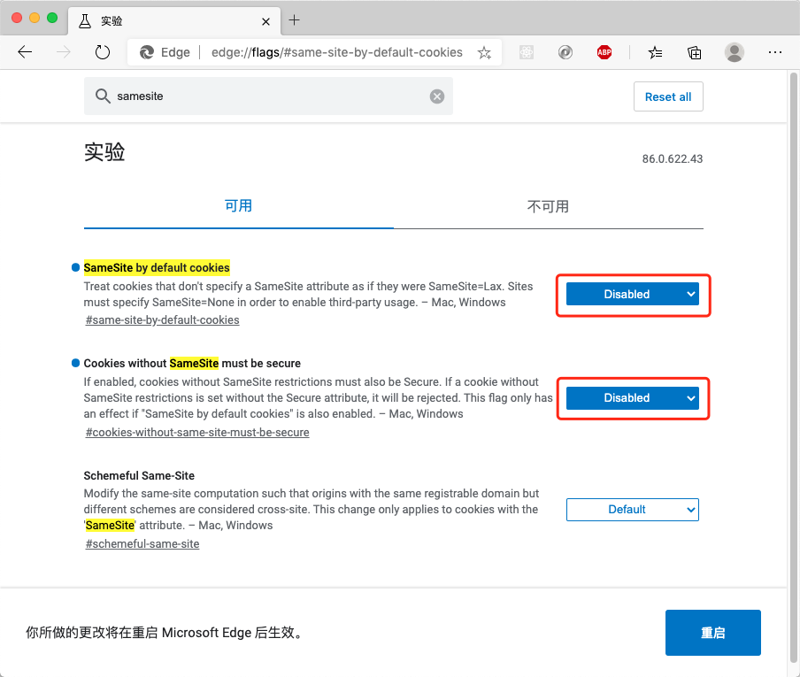

# Cookie 的 SameSite 属性

## 背景

在处理 `iframe` 内嵌页面的时候，发现 `Chrome` 浏览器始终无法保持登录状态。后来发现是因为 `Chrome` 默认将 `SameSite` 默认值设置为了 `Lax`，导致出现了跨域的问题，无法传递内层的 `cookie`。

在不特殊处理 `cookie` 的情况下，浏览器兼容情况如下：

| 浏览器  | 是否兼容              |
| ------- | --------------------- |
| Chrome  | 需要特殊处理 `cookie` |
| Safari  | √                     |
| Firefox | √                     |
| Edge    | 需要特殊处理 `cookie` |

## SameSite 属性

`Cookie` 的 `SameSite` 属性用来限制第三方 `Cookie`，从而减少安全风险。

`Samesite` 有三个值：

1. `Strict`

严格模式，完全禁止第三方 `Cookie`，跨站点时，任何情况下都不会发送 `Cookie`。换言之，只有当前网页的 `URL` 与请求目标一致，才会带上 `Cookie`。

2. `Lax`

规则稍稍放宽，大多数情况也是不发送第三方 `Cookie`，但是导航到目标网址的 `Get` 请求除外。

导航到目标网址的 GET 请求，只包括三种情况：链接，预加载请求，GET 表单。详见下表。

| 请求类型  |                 示例                 |    正常情况 | Lax                                    |
| :-------- | :----------------------------------: | ----------: | :------------------------------------- |
| 链接      |         ``         | 发送 Cookie | 发送 Cookie                            |
| 预加载    | `<link rel="prerender" href="..."/>` | 发送 Cookie | 发送 Cookie                            |
| GET 表单  |  `<form method="GET" action="...">`  | 发送 Cookie | 发送 Cookie                            |
| POST 表单 | `<form method="POST" action="...">`  | 发送 Cookie | 不发送 |
| iframe    |    `<iframe src="..."></iframe>`     | 发送 Cookie | 不发送 |
| AJAX      |            `$.get("...")`            | 发送 Cookie | 不发送 |
| Image     |          ``           | 发送 Cookie | 不发送 |

3. `None`

`Chrome` 已经将 `Lax` 变为默认设置。这时，网站可以选择显式关闭 `SameSite` 属性，将其设为`None`。不过，前提是必须同时设置 `Secure` 属性（`Cookie` 只能通过 `HTTPS` 协议发送），否则无效。

## 临时解决

可以禁用掉 `Chrome` 浏览器的这个属性。

`chrome://flags/#same-site-by-default-cookies`

新版本的 `Edge` 浏览器也是 `Chromiun` 内核，所以也可以禁用 `SameSite`。

`edge://flags/#same-site-by-default-cookies`

## 完全解决

调整 `SameSite` 的值为 `None`。例如H5版本的淘宝。

## 参考

- [Chromium - SameSite Updates‎](https://www.chromium.org/updates/same-site/incompatible-clients)
- [阮一峰的网络日志 - Cookie 的 SameSite 属性](http://www.ruanyifeng.com/blog/2019/09/cookie-samesite.html)
