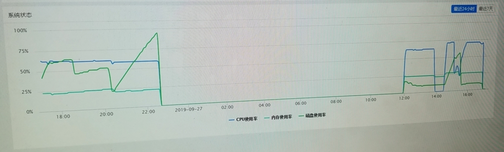
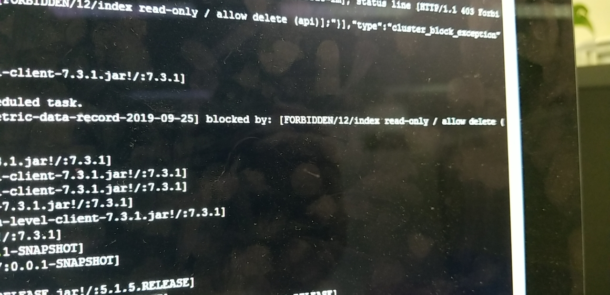

# 磁盘空间不足导致 Elasticsearch 锁定索引无法写入数据

<ArticleMeta />

## 发现问题

巡检生产环境时发现单节点 ES 在某段时间内没有数据，并且磁盘使用率直线上升。



## 追溯问题

- 首先查看 ES 索引，发现那段时间内所有的索引都没有数据写入
- 然后查看生成环境日志，发现 ES 抛出一个错误：

`blocked by: [FORBIDDEN/12/index read-only / allow delete (api)];`



## 问题原因

### ES 索引无法写入

默认情况下，ES 磁盘使用率在超过 95% 时，ES 为了防止节点完全用完磁盘空间，为保护节点可用，所有索引将进入 `read-only` 模式。数据无法继续写入，索引无法关闭，只能删除索引。

---

*磁盘的三个默认警戒水位线：*

- `cluster.routing.allocation.disk.watermark.low`

**低警戒水位线** —— 默认为磁盘容量的 85％。

Elasticsearch 不会将分片分配给使用磁盘超过 85％的节点。它也可以设置为绝对字节值（如 500mb），以防止 Elasticsearch 在小于指定的可用空间量时分配分片。此设置不会影响新创建的索引的主分片，或者特别是之前任何从未分配过的分片。

- `cluster.routing.allocation.disk.watermark.high`

**高警戒水位线** —— 默认为磁盘容量的 90％。

Elasticsearch 将尝试从磁盘使用率超过 90％的节点重新分配分片。它也可以设置为绝对字节值，以便在节点小于指定的可用空间量时将其从节点重新分配。此设置会影响所有分片的分配，无论先前是否分配。

- `cluster.routing.allocation.disk.watermark.flood_stage`

**洪水警戒水位线** —— 默认为磁盘容量的 95％。

Elasticsearch 对每个索引强制执行只读索引块（`index.blocks.read_only_allow_delete`）。这是防止节点耗尽磁盘空间的最后手段。一旦有足够的可用磁盘空间允许索引操作继续，就**必须手动释放**索引块。

可以使用以下方法使索引恢复正常：

```bash
curl -XPUT -H "Content-Type: application/json" http://localhost:9200/_all/_settings -d '{"index.blocks.read_only_allow_delete": null}'
```
### 磁盘使用飙升

由于某个 bug 导致流量日志数据压缩失败，导致磁盘使用量在迅速飙升。因此触发 ES 的保护机制锁死了索引。

## 解决问题

- 扩容磁盘。简单粗暴。
- 关闭 `threshold_enabled` 设置。在对磁盘使用率不会过高有把握的情况下，为了防止 ES 自动对每个索引强制执行只读索引块，避免每次都需要手动释放，可以关闭掉此设置。

```bash
curl -XPUT -H "Content-Type: application/json" http://localhost:9200/_cluster/settings -d '{ "transient": { "cluster.routing.allocation.disk.threshold_enabled": false } }'
```
或者是直接修改 `elasticsearch.yml` 配置文件

```yaml
cluster.routing.allocation.disk.threshold_enabled: false
```

## 参考资料

- [https://stackoverflow.com/questions/50609417/elasticsearch-error-cluster-block-exception-forbidden-12-index-read-only-all](https://stackoverflow.com/questions/50609417/elasticsearch-error-cluster-block-exception-forbidden-12-index-read-only-all)

- [Elasticsearch Reference [7.4] » Modules » Shard allocation and cluster-level routing » Disk-based shard allocation](https://www.elastic.co/guide/en/elasticsearch/reference/current/disk-allocator.html)