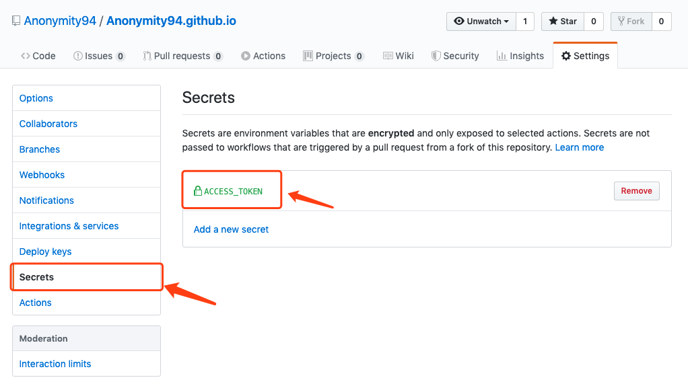
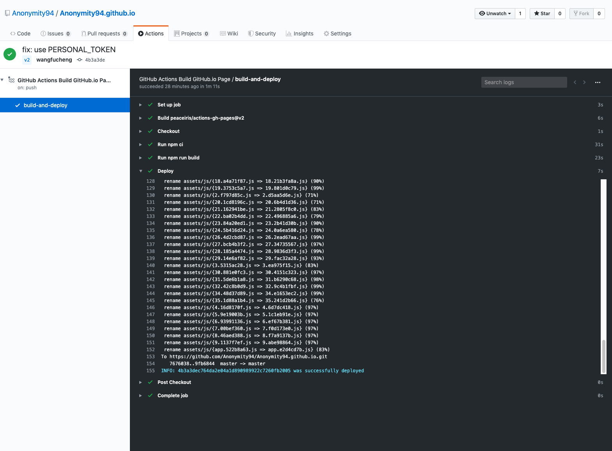

# 使用 GitHub Actions 自动发布博客

<ArticleMeta />

## 设置 `GitHub` 仓库的 `Secrets`

按照[官方文档](https://help.github.com/en/github/authenticating-to-github/creating-a-personal-access-token-for-the-command-line)，生成一个密钥。然后，将这个密钥储存到当前仓库的 `Settings/Secrets` 里面。



## 修改 `package.json`

```json{5}
"dependencies": {
    "less": "^3.10.1",
    "less-loader": "^5.0.0"
  },
  "homepage": "http://anonymity94.github.io/"
```

## 调整`vuepress`构建后的输出目录

参考：[VuePress配置#dest](https://vuepress.vuejs.org/zh/config/#dest)

```js
module.exports = {
  dest: 'build'
}
```

## 创建 `ci.yml`

在仓库的根目录创建文件 `.github/workflows/ci.yml`。*`ci.yml`文件名可以随意取*

这里使用 [peaceiris/actions-gh-pages@v2](https://github.com/peaceiris/actions-gh-pages)。

```yml
name: GitHub Actions Build GitHub.io Page
on:
  push:
    branches:
    # 源码分支v2
      - v2
jobs:
  build-and-deploy:
    runs-on: ubuntu-latest
    steps:
    - name: Checkout
      uses: actions/checkout@master

    - run: npm ci
    - run: npm run build  

    - name: Deploy
      uses: peaceiris/actions-gh-pages@v2
      env:
        PERSONAL_TOKEN: ${{ secrets.ACCESS_TOKEN }}
        # 构建后的文件发布到master分支上
        PUBLISH_BRANCH: master
        # 这里和vuepress构建输出的目录有关
        PUBLISH_DIR: ./build
        BUILD_SCRIPT: npm install && npm run build
```

## 推送仓库到 GitHub



## 参考

- [阮一峰的网络日志 - GitHub Actions 入门教程](http://www.ruanyifeng.com/blog/2019/09/getting-started-with-github-actions.html)

- [Vuepress + GitHub Actions 静态博客全攻略](https://zhuanlan.zhihu.com/p/93030651)