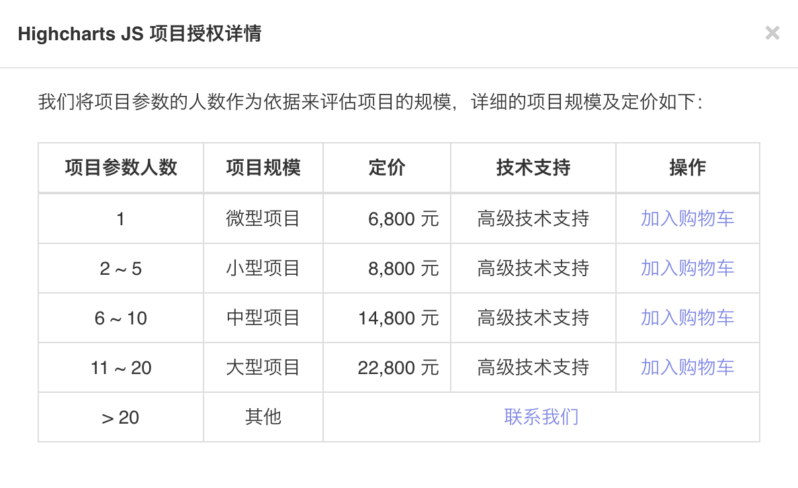

# Highcharts vs. ECharts vs. G2Plot

## License

| Chart                                              | License                                                      |
| -------------------------------------------------- | ------------------------------------------------------------ |
| [Highcharts](https://www.highcharts.com.cn/)       | [商业授权](https://highcharts.com.cn/license)                |
| [ECharts](http://echarts.apache.org/zh/index.html) | [Apache License 2.0](https://github.com/apache/incubator-echarts/blob/master/LICENSE) |
| [G2Plot](https://g2.antv.vision/zh)                | [MIT](https://github.com/antvis/G2Plot/blob/master/LICENSE)  |

根据 `Highcharts` 的使用协议，非商业行为可以直接使用，商业行为需要购买授权。

### Highcharts的非商业行为

>非商业使用，可以直接下载我们的软件并直接使用而不用取得我们的授权。
>
>使用时请遵守 CC BY-NC 3.0 (Creative Commons Attribution-NonCommercial 3.0 License) 协议。
>
>CC BY-NC 3.0 中文详情请参考：[署名-非商业性使用 3.0 中国大陆 (CC BY-NC 3.0 CN)](http://creativecommons.org/licenses/by-nc/3.0/cn/)

- 学校
- 公益组织或非盈利机构
- 软件测试阶段

### Highcharts的商业授权种类

- 项目授权
- 开发者授权
- OEM授权

为此，我专门咨询了代理商关于授权价格的事情：

#### 项目授权

- 使用场景：仅仅针对内部项目使用

- 报价：

  

#### 开发者授权

- 使用场景：仅仅针对内部项目使用

- 报价：

  | 人数 | 定价          |
  | ---- | ------------- |
  | 1    | **7,900 元**  |
  | 5    | **31,600 元** |
  | 10   | **55,000 元** |

需要注意的是，项目授权开发者授权区别在于可使用项目的数量：

- 相同点是，都只能用于公司内部项目，不能用于对外销售的情况；
- 不同点是，项目授权是针对一个项目，开发者授权可以用于多个项目

::: tip

:::

#### OEM授权

> OEM 授权是针对软件大批量（10份、100份、500份、1000份等）销售的情况。如果使用或包含我们的软件的产品用于大批量销售，则必须购买 OEM 授权。
> 
> **OEM 授权的定价是由销售的产品的具体情况定价的，定价标准包括产品销售份数、产品定价、研发人员数量等。**

- 使用场景：大规模对外销售
- 报价：

**每个公司的定价应该是都不一样的，仅供参考。**
 

 #### 数量较少的对外销售的项目

数量较少（10个以内），达不到批量的数量级，可以考虑给客户授权。
授权价格按照项目授权，可按数量给一定的优惠。

（OEM授权比单个项目授权是要便宜很多的 =.=）

**另外，如果和别的公司合作，统一包装OEM，自己的公司购买授权即可。**

## 框选操作

在实际使用中，我有一个框选的需求：

- 鼠标框选
- 获取框选中 `x` 轴的起止值时间
- 阻断内置默认的交互动作
- 根据起止时间做数据请求
- 重新渲染 `Chart`

我实际使用中发现，`G2Plot` 难于 `ECharts` 难于 `Highcharts`。

### `Highcharts` 实现框选

直接使用 [`chart` -> `events` -> `selection`](https://api.highcharts.com.cn/highcharts#chart.events.selection)即可。

<iframe src="https://codesandbox.io/embed/highcharts-brush-jud0k?fontsize=14&hidenavigation=1&theme=dark"
  style="width:100%; height:500px; border:0; border-radius: 4px; overflow:hidden;"
  title="Highcharts-brush"
  allow="accelerometer; ambient-light-sensor; camera; encrypted-media; geolocation; gyroscope; hid; microphone; midi; payment; usb; vr; xr-spatial-tracking"
  sandbox="allow-forms allow-modals allow-popups allow-presentation allow-same-origin allow-scripts"
></iframe>

### `ECharts` 实现框选

也有相应的`API`

<iframe src="https://codesandbox.io/embed/echarts-brush-20osn?fontsize=14&hidenavigation=1&theme=dark"
  style="width:100%; height:500px; border:0; border-radius: 4px; overflow:hidden;"
  title="ECharts-brush"
  allow="accelerometer; ambient-light-sensor; camera; encrypted-media; geolocation; gyroscope; hid; microphone; midi; payment; usb; vr; xr-spatial-tracking"
  sandbox="allow-forms allow-modals allow-popups allow-presentation allow-same-origin allow-scripts"
></iframe>

### `G2Plot` 实现框选

**这里使用 `G2Plot` 的 `React` 版本：[Ant Design Charts](https://charts.ant.design/)**

这个稍微复杂些，需要自己定制框选行为，然后 `registerInteraction` 注册进去。

详细问题参考我在官方仓库下提的 [如何框选？](https://github.com/antvis/G2Plot/issues/1903)

<iframe src="https://codesandbox.io/embed/g2plot-brush-4rxq9?fontsize=14&hidenavigation=1&theme=dark"
  style="width:100%; height:500px; border:0; border-radius: 4px; overflow:hidden;"
  title="G2Plot-brush"
  allow="accelerometer; ambient-light-sensor; camera; encrypted-media; geolocation; gyroscope; hid; microphone; midi; payment; usb; vr; xr-spatial-tracking"
  sandbox="allow-forms allow-modals allow-popups allow-presentation allow-same-origin allow-scripts"
></iframe>