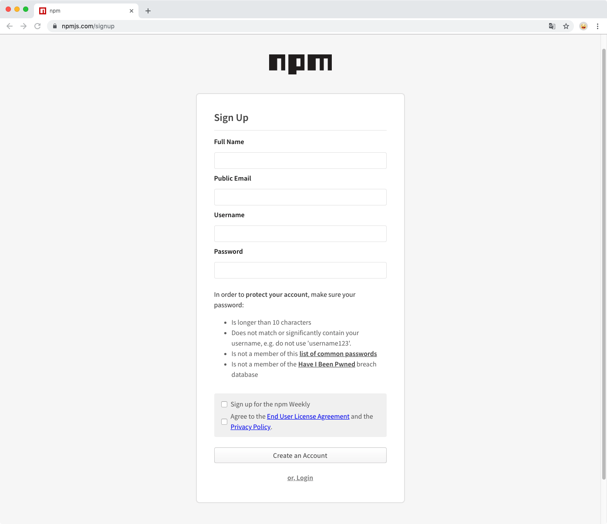
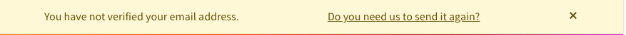
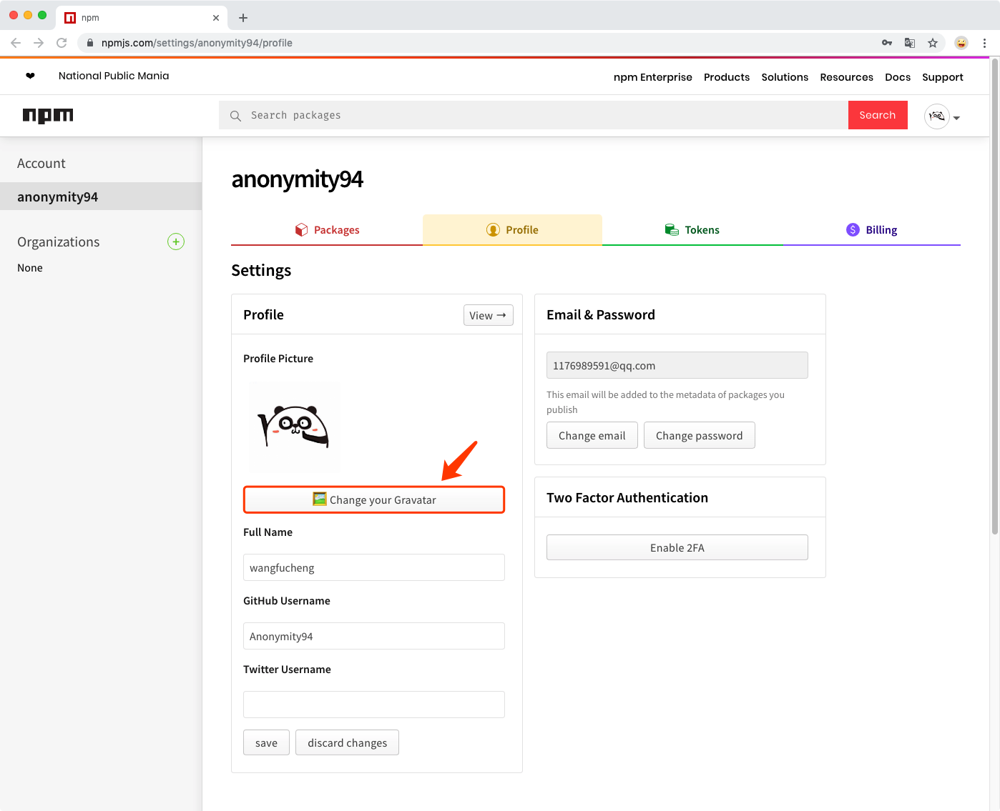
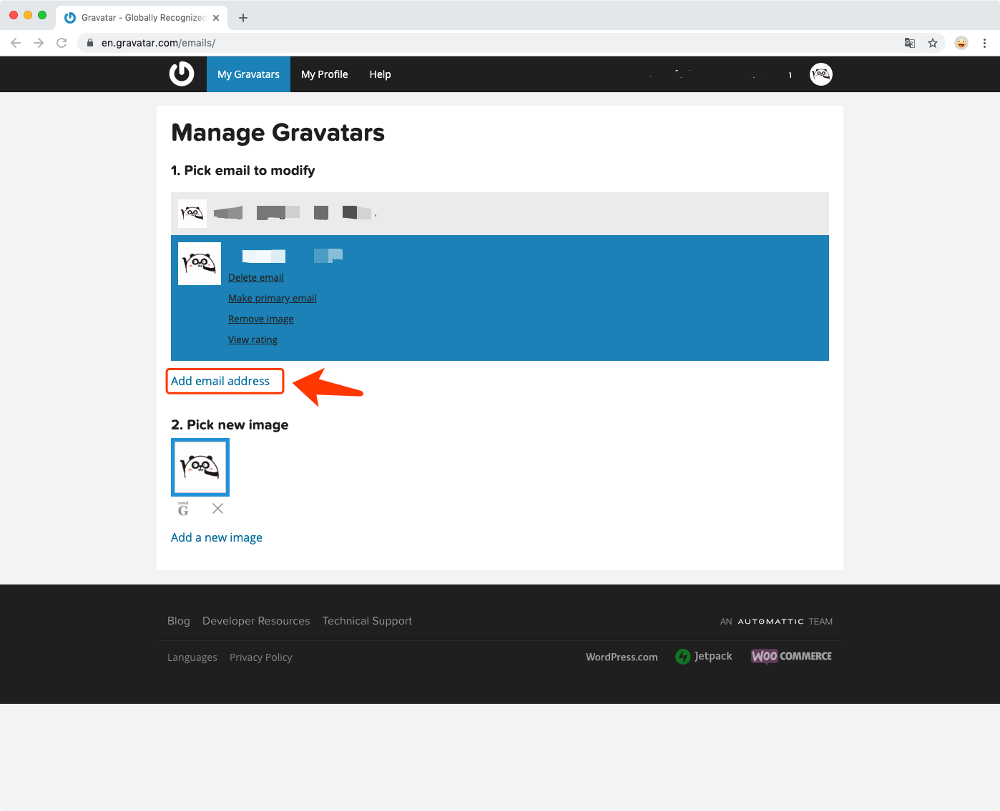
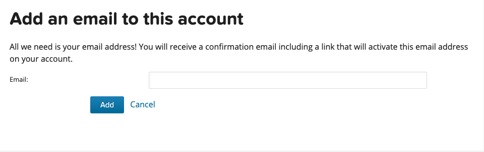
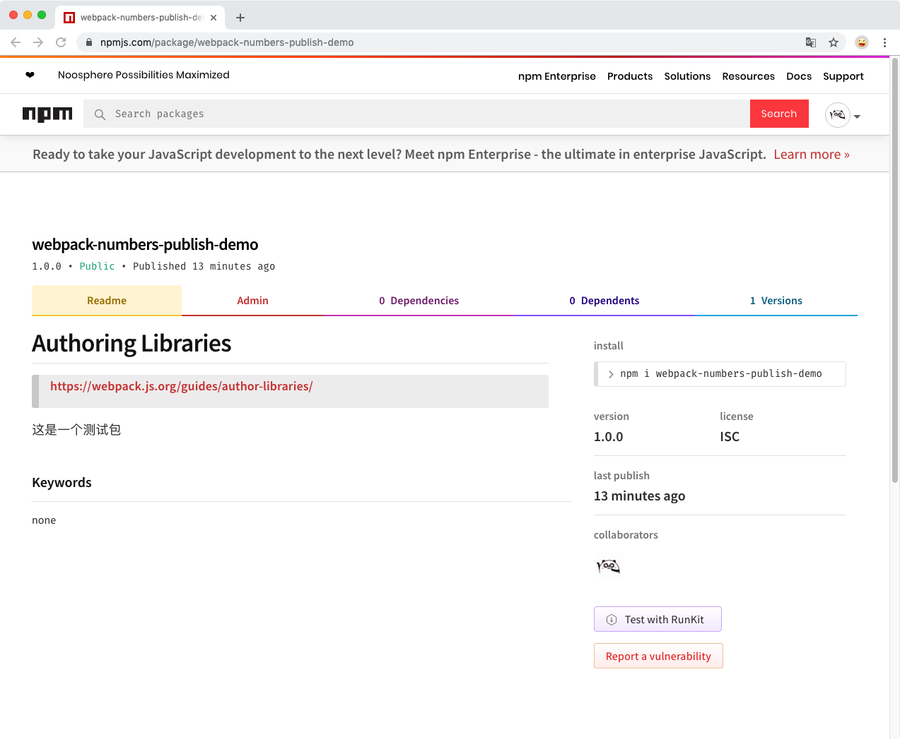
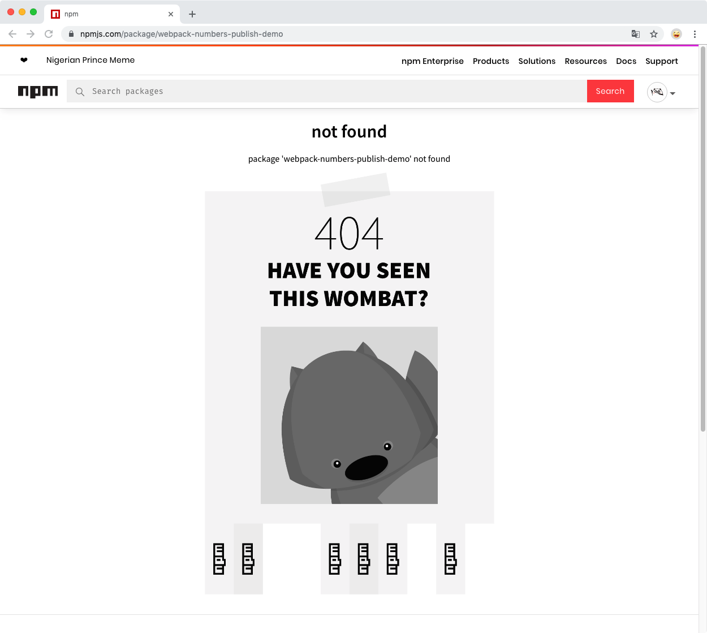

# 如何发布 npm 包


这里借助 webpack 官网中的一个 [demo](https://webpack.js.org/guides/author-libraries/) 来演示如何发布一个 npm 包。

## 注册 npm 账号

> 官网：[npmjs.com](https://www.npmjs.com/)


### 填写注册信息

登录官网，点击 `Join` 注册账户，填写 `Full Name`、`Public Email`、`Username`、`Password`信息，点击 `Create an Account` 按钮进行注册。

*注册后，`Username` 将无法进行修改，请认真起名字~*



### 验证邮箱

注册后，npm 网站会出现一个需要验证邮箱的提示信息。



同时，注册邮箱会收到一封验证邮件。如果没有验证邮箱地址，将无法发布 npm 包。

## 修改 npm 默认头像（可选）

> 这一步无关紧要，你可以点击[此处](#设置镜像源)跳过，进入下一步~

npm 使用 [Gravatar](https://cn.gravatar.com/) 头像，这里可以将 npm 头像设置为自定义头像。
- 点击页面右上角头像，点击 `Profile Settings`，进入个人信息设置页面



- 点击 `🖼 Change your Gravatar` 进入 `gravatar` 网站

- 点击 `Add email address`，输入注册npm账号的邮箱，然后点击 `Add`





- `Add a new image` 增加头像
- 点击新增的头像，`Pick new image` 为其选择头像

*npm网站头像同步略有延迟*

## 设置镜像源

`npm config list` 查看 npm 配置信息。如果发现 `registry` 不是官方源 `http://registry.npmjs.org`，请将仓库镜像源设置成**官方镜像**: `npm config set registry=http://registry.npmjs.org`。
否则发布时会出现 `npm ERR! publish Failed PUT 403`。

```bash
wangfuchengdeMac-mini:webpack-numbers wangfucheng$ npm publish
npm notice 
npm notice 📦  webpack-numbers-demo@1.0.0
npm notice === Tarball Contents === 
npm notice 357B  package.json              
npm notice 94B   README.md                 
npm notice 435B  webpack.config.js         
npm notice 1.7kB dist/webpack-numbers.js   
npm notice 622B  example/browser/index.html
npm notice 218B  example/node/index.js     
npm notice 678B  src/index.js              
npm notice 254B  src/ref.json              
npm notice === Tarball Details === 
npm notice name:          webpack-numbers-demo                    
npm notice version:       1.0.0                                   
npm notice package size:  2.2 kB                                  
npm notice unpacked size: 4.4 kB                                  
npm notice shasum:        d4c8eeedcdfd8740d86cbff0e7406240afcb927b
npm notice integrity:     sha512-C9dqKauWLpHtd[...]fZQsfi1tZ86aQ==
npm notice total files:   8                                       
npm notice 
npm ERR! publish Failed PUT 403
npm ERR! code E403
npm ERR! [no_perms] Private mode enable, only admin can publish this module [no_perms] Private mode enable, only admin can publish this module: webpack-numbers-demo
```

## 本地终端登录 npm
 
本地试用 `npm adduser` 登录 npm

```bash
wangfuchengdeMac-mini:webpack-numbers wangfucheng$ npm adduser
Username: anonymity94
Password: 
Email: (this IS public) 1176989591@qq.com
Logged in as anonymity94 on http://registry.npmjs.org/.
```

可以使用 `npm config list` 查看 npm 登录信息

```bash
wangfuchengdeMac-mini:webpack-numbers wangfucheng$ npm config list
; cli configs
metrics-registry = "http://registry.npmjs.org/"
scope = ""
user-agent = "npm/6.4.1 node/v10.15.2 darwin x64"

; userconfig /Users/wangfucheng/.npmrc
//registry.npm.taobao.org/:always-auth = false
//registry.npm.taobao.org/:email = "1176989591@qq.com"
//registry.npm.taobao.org/:username = "anonymity94"
registry = "http://registry.npmjs.org/"

; node bin location = /Users/wangfucheng/.nvm/versions/node/v10.15.2/bin/node
; cwd = /Users/wangfucheng/coading/webpack-numbers
; HOME = /Users/wangfucheng
; "npm config ls -l" to show all defaults.
```

## 发布 npm 包

### 确认包名称和版本

确认 `package.json` 中的 `name` 和 `version` 字段。

当要发布的包名和 npm 上的包重名时会有错误产生，所以可以先去 npm 官网上搜索一下，名字是否已被使用。

发布包的名字要保证是**独一无二**的。当重名时会有如下错误：

```bash{24}
wangfuchengdeMac-mini:webpack-numbers wangfucheng$ npm publish
npm notice 
npm notice 📦  webpack-numbers-demo@1.0.0
npm notice === Tarball Contents === 
npm notice 357B  package.json              
npm notice 94B   README.md                 
npm notice 435B  webpack.config.js         
npm notice 1.7kB dist/webpack-numbers.js   
npm notice 622B  example/browser/index.html
npm notice 218B  example/node/index.js     
npm notice 678B  src/index.js              
npm notice 254B  src/ref.json              
npm notice === Tarball Details === 
npm notice name:          webpack-numbers-demo                    
npm notice version:       1.0.0                                   
npm notice package size:  2.2 kB                                  
npm notice unpacked size: 4.4 kB                                  
npm notice shasum:        d4c8eeedcdfd8740d86cbff0e7406240afcb927b
npm notice integrity:     sha512-C9dqKauWLpHtd[...]fZQsfi1tZ86aQ==
npm notice total files:   8                                       
npm notice 
npm ERR! publish Failed PUT 403
npm ERR! code E403
npm ERR! You do not have permission to publish "webpack-numbers-demo". Are you logged in as the correct user? : webpack-numbers-demo

npm ERR! A complete log of this run can be found in:
npm ERR!     /Users/wangfucheng/.npm/_logs/2019-09-04T08_34_20_996Z-debug.log
```

### 发布

使用 `npm publish` 命令进行发布。

```bash
wangfuchengdeMac-mini:webpack-numbers wangfucheng$ npm publish
npm notice 
npm notice 📦  webpack-numbers-publish-demo@1.0.0
npm notice === Tarball Contents === 
npm notice 365B  package.json              
npm notice 94B   README.md                 
npm notice 435B  webpack.config.js         
npm notice 1.7kB dist/webpack-numbers.js   
npm notice 622B  example/browser/index.html
npm notice 218B  example/node/index.js     
npm notice 678B  src/index.js              
npm notice 254B  src/ref.json              
npm notice === Tarball Details === 
npm notice name:          webpack-numbers-publish-demo            
npm notice version:       1.0.0                                   
npm notice package size:  2.2 kB                                  
npm notice unpacked size: 4.4 kB                                  
npm notice shasum:        cbe951478422f1ec93d25bd9f675e57741322ad9
npm notice integrity:     sha512-n7nVwkFJrAVlB[...]PMWQNDRdmGpZA==
npm notice total files:   8                                       
npm notice 
+ webpack-numbers-publish-demo@1.0.0
```

发布成功后，可以在 npm 仓库中搜索到。



## 删除 npm 包

已经发布的包，只允许在72小时内撤销。

> [https://docs.npmjs.com/unpublishing-packages-from-the-registry](https://docs.npmjs.com/unpublishing-packages-from-the-registry)
>
> <br/>
> In order to permanently remove a package (or package version) from the npm registry, as a package owner or collaborator, you can unpublish it from the the command line within 72 hours of the initial publish.

删除命令：`npm unpublish --force`。

```bash
wangfuchengdeMac-mini:webpack-numbers wangfucheng$ npm unpublish --force
npm WARN using --force I sure hope you know what you are doing.
- webpack-numbers-publish-demo@1.0.0
```
删除后，npm 仓库中已经找不到相关的包。



## ⚠️ 错误总结

- 镜像不是官方镜像

```bash
npm ERR! publish Failed PUT 403
npm ERR! code E403
npm ERR! [no_perms] Private mode enable, only admin can publish this module [no_perms] Private mode enable, only admin can publish 
```

- 邮箱未验证

```bash
npm ERR! You must verify your email before publishing a new package: https://www.npmjs.com/email-edit : cuitaonpm
```

- 账户未登录

```bash
npm ERR! code ENEEDAUTH
npm ERR! need auth auth required for publishing
npm ERR! need auth You need to authorize this machine using `npm adduser`
```

- 包名已经被使用

```bash
npm ERR! publish Failed PUT 403
npm ERR! code E403
npm ERR! You do not have permission to publish "webpack-numbers-demo". Are you logged in as the correct user? : webpack-numbers-demo
```