# 如何使用 Kibana

[[toc]]

---

## Discover - 发现

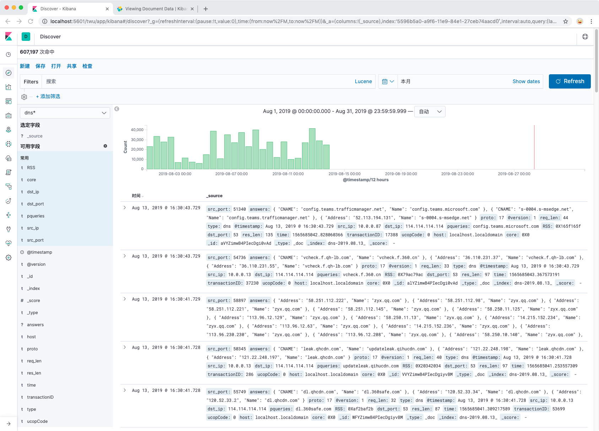

### 设置时间过滤器

### 搜索数据
可以使用2种搜索语法

#### [Kibana查询语言](https://www.elastic.co/guide/en/kibana/7.0/kuery-query.html)(KQL) 
- `resonse:200`将匹配响应字段与值200匹配的文档
- `not response:200` 将匹配响应不是200的所有文档。
- `response:200 or extension:php` 将匹配响应匹配200，扩展名匹配php或两者的文档。
- `tags:(success and info and security)`

#### Lucene
- `200` 查找任意字段包含数字 200 的请求
- `status:200` 在状态字段中查找 200
- `status:[400 TO 499]` 查找所有介于 400-499 之间的状态代码
- `status:[400 TO 499] AND extension:PHP` 查找状态代码 400-499 以及扩展名 php
- `status:[400 TO 499] AND (extension:php OR extension:html)` 查找状态代码 400-499 以及扩展名 php 或 html

### 按字段过滤
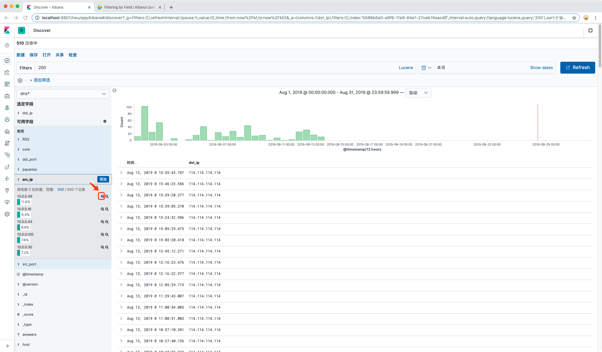

- 列表展示某个字段: 
  - 可用字段 -> 点击[添加]按钮，该字段会出现在右侧的表格中

- 过滤某个字段的某个值:
  - 添加正滤镜，请单击“ 正滤镜”按钮 正滤波器。这仅包括在该字段中包含该值的那些文档
  - 要添加负滤镜，请单击“ 否定滤镜”按钮 负滤波器。这不包括在该字段中包含该值的文档。

### 保存搜索
保存本次搜索，保存的搜索查询可以用来创建可视化
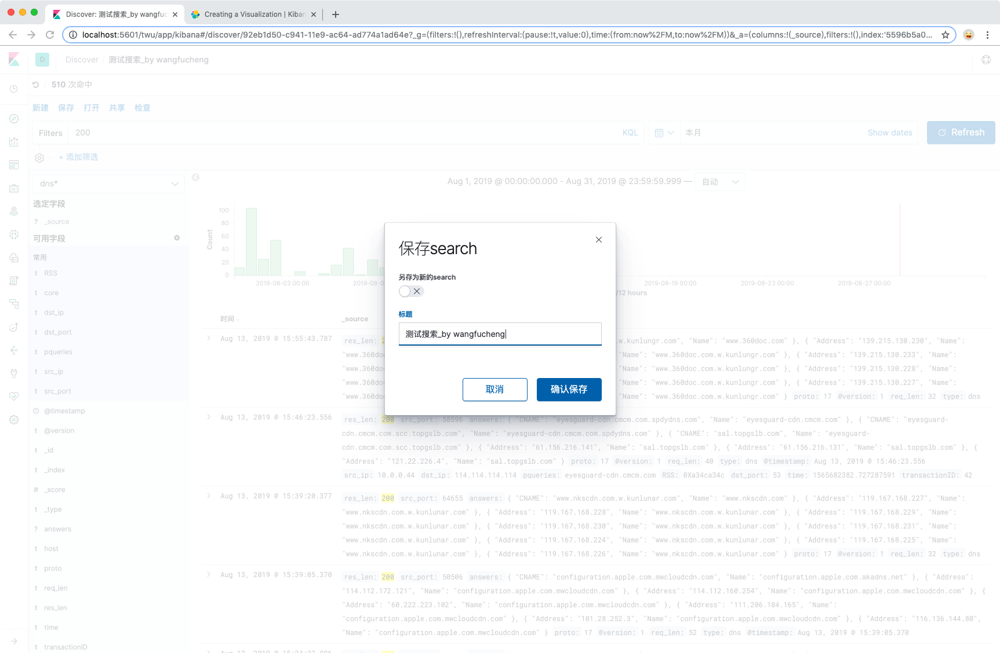

### 打开历史搜索
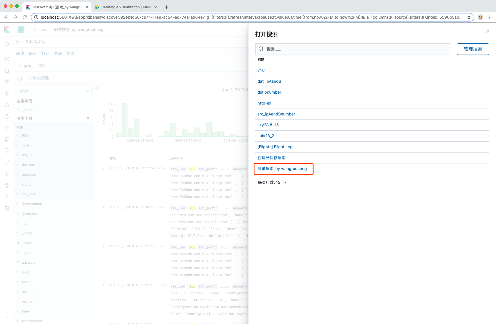

### 分享本次搜索

## Visualize - 可视化
Visualize使您可以在Elasticsearch索引中创建数据的可视化。然后，您可以构建显示相关可视化的仪表板。
您可以从通过Discover保存的搜索创建可视化，也可以 从新的搜索查询开始。

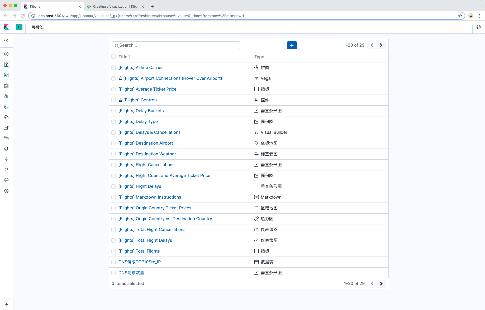

### 新建可视化

示例：**TCP上下行流量折线图** 

#### 1. 选择可视化类型
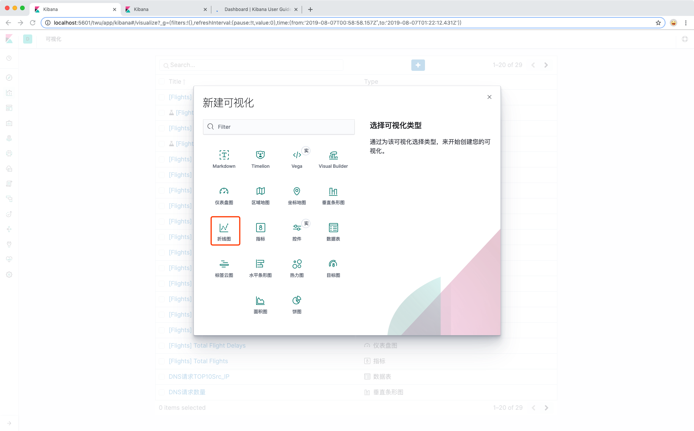

#### 2. 选择索引模式
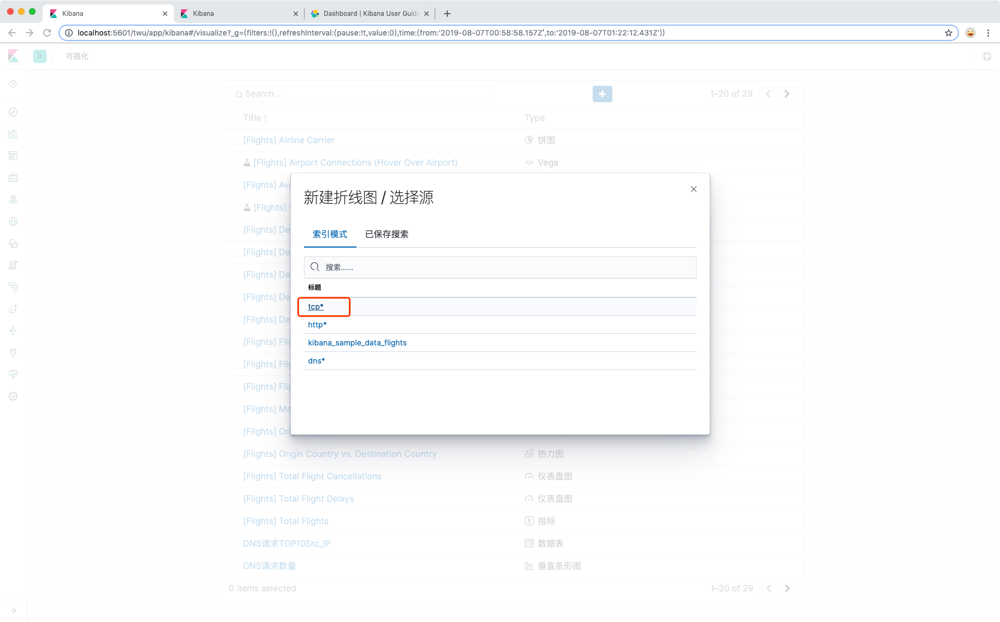

#### 3. 进入编辑页面
上述步骤后，我们可以看到一个初始化的折线图
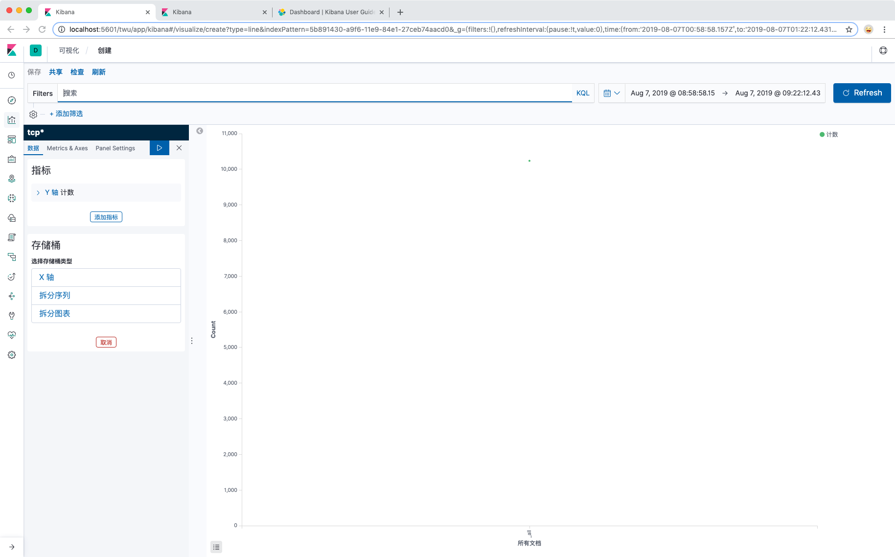

#### 4. 编辑 X 轴信息
- 选择聚合方式：日期直方图
- 选择聚合字段：@timestamp
- 选择时间间隔：秒
- 点击执行按钮

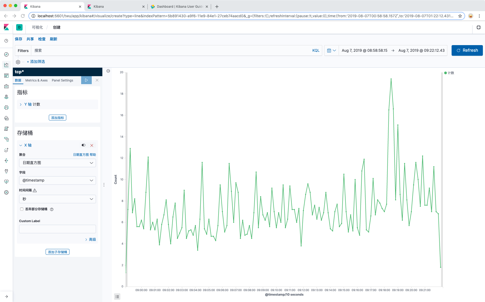

#### 5. 编辑 Y 轴指标
- 选择聚合方式：和
- 选择聚合字段：downbytes
- Custom Label：下行流量
- 点击执行按钮

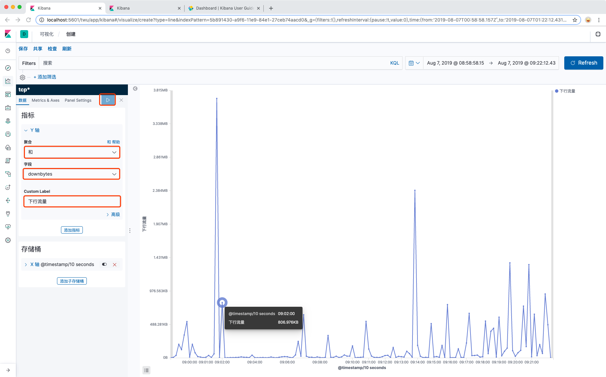

#### 6.修改线条的颜色标志
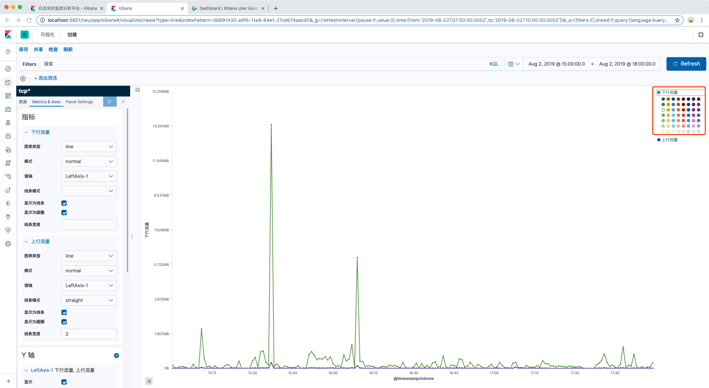

## Dashboard - 仪表盘 
Kibana 仪表板是可视化，搜索和地图的集合，通常是实时的。仪表板提供对数据的一览式洞察，使您能够深入了解详细信息。

### 添加面板
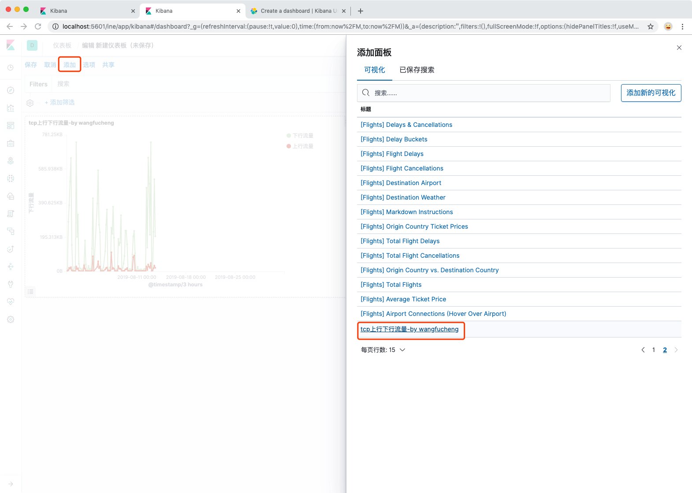

### 调整面板
- 编辑可视化信息（面板）
- 定制面板标题
- 拖拽位置、大小
- 隐藏/显示图例

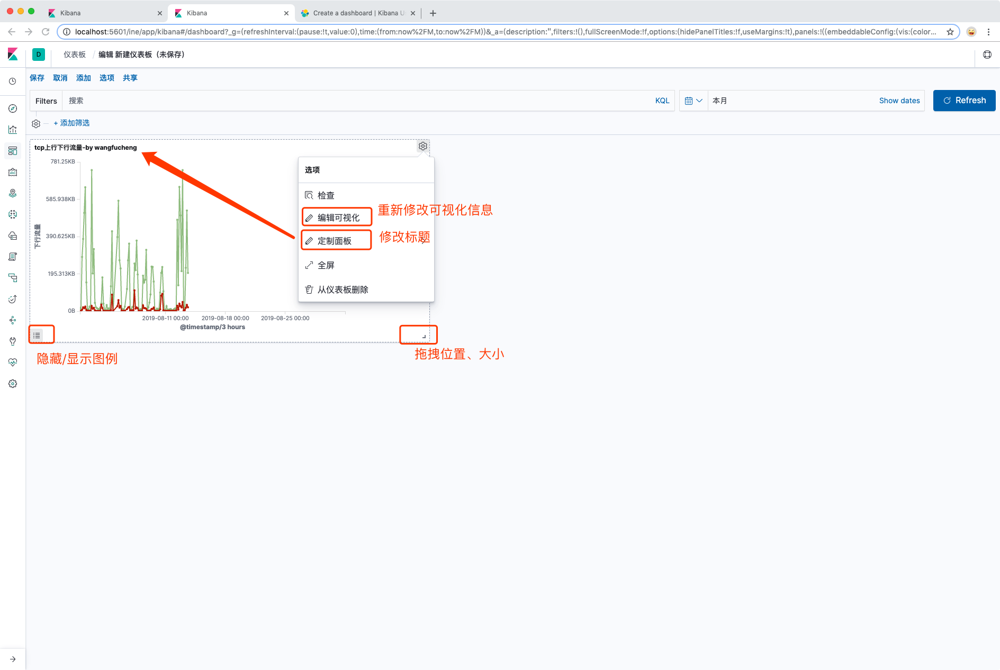

## Canvas - 画布

Canvas是位于Kibana内的数据可视化和演示工具。使用Canvas，您可以直接从Elasticsearch提取实时数据，并将数据与颜色，图像，文本和想象结合起来，创建动态，多页，像素完美的显示。如果你有点创意，有点技术性，而且非常好奇，那么Canvas就适合你。

使用Canvas，您可以：
- 使用背景，边框，颜色，字体等创建和个性化您的工作空间。
- 使用您自己的可视化（例如图像和文本）自定义工作台。
- 通过直接从Elasticsearch提取数据来自定义数据。
- 使用图表，图形，进度监视器等显示您的数据。
- 使用过滤器聚焦要显示的数据。

## Machine Learning - 机器学习

随着数据集的大小和复杂性的增加，检查仪表板或维护用于发现基础架构问题，网络攻击或业务问题的规则所需的人力工作变得不切实际。弹性机器学习异常检测功能可以自动模拟时间序列数据的正常行为 - 学习趋势，周期性等 - 实时识别异常，简化根本原因分析并减少误报。

异常检测在Elasticsearch中运行并扩展，并在Kibana 机器学习页面上包含一个直观的UI，用于创建异常检测作业和理解结果。