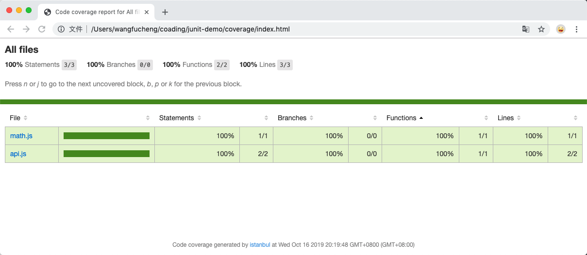

# 前端测试框架


> [Demo 源码](https://github.com/Anonymity94/junit-demo)

## Mocha

### 简介

Mocha 是一个功能丰富的 JavaScript 测试框架，可在 Node.js 和浏览器中运行，从而使异步测试变得简单而有趣。Mocha 测试按顺序运行，从而可以灵活，准确地报告，同时将未捕获的异常映射到正确的测试用例。

### 官网文档

[Mocha](https://mochajs.org/)

### 安装

```bash
npm install --global mocha
```

or

```bash
npm install --save-dev mocha
```

### 断言库

不内置断言库。Mocha 允许您使用所需的任何断言库：

- [assert](https://nodejs.org/api/assert.html)
- [should.js](https://github.com/shouldjs/should.js)
- [expect.js](https://github.com/Automattic/expect.js)
- [chai.js](https://github.com/chaijs/chai)

### 主要的 2 个 api

- `describe`：测试套件，表示一组相关的测试。
- `it`：测试用例，表示一个单独的测试，是测试的最小单位。

### Hooks

- befor：定义测试之前进行的操作
- after：定义测试之后进行的操作
- beforeEach：定义每条测试之前进行的操作
- afterEach：定义每条测试之后进行的操作

### 同步测试

```js
const expect = require('expect.js')
import { add } from '../../src/math'

describe('Math suite', function() {
  it('should expose a function', function() {
    expect(add).to.be.a('function')
  })

  it('should return true for: 1 + 3 === 4', function() {
    expect(add(1, 3)).to.equal(4)
  })
})
```

```bash
> junit-demo@1.0.0 test:mocha /Users/wangfucheng/coading/junit-demo
> mocha --recursive ./tests/mocha/*.test.js

  Math suite
    ✓ should expose a function
    ✓ should do math

  2 passing (14ms)
```

### 异步测试

```js
import '@babel/polyfill'
import { getCnodeTopics } from '../../src/api'

const expect = require('expect.js')

describe('cnode api test', () => {
  it('should return true for result.success', async () => {
    const response = await getCnodeTopics()
    expect(response.success).to.be(true)
  })

  it('should return true for result.data type as Array', async () => {
    const response = await getCnodeTopics()
    expect(response.data).to.be.a('array')
  })

  it('should return true for result.data.length === 40', async () => {
    const response = await getCnodeTopics()
    expect(response.data.length).to.be(40)
  })
})
```

```bash
> junit-demo@1.0.0 test:mocha /Users/wangfucheng/coading/junit-demo
> mocha --recursive ./tests/mocha/*.test.js

  cnode api test
    ✓ should return true for result.success (813ms)
    ✓ should return true for result.data type as Array (554ms)
    ✓ should return true for result.data.length === 40 (703ms)
```

## Jest

### 简介

Jest 是 Facebook 开源的一款 JS 单元测试框架。Jest 除了基本的断言和 Mock 功能外，还有快照测试、实时监控模式、覆盖度报告等实用功能。

- 方便的异步测试
- `snapshot` 功能
- 集成断言库，无需引用其他第三方库
- 对 `React` 天生支持

### 官网

[Jest](https://jestjs.io/)

### 安装

```bash
npm install --global jest
```

or

```bash
npm install --save-dev jest
```

### 常用断言库方法

```js
toBe(value) //是否是某个值
toBeUndefined() // 只匹配 undefined
toHaveBeenCalled() // 是否被调用
toBeTruthy() // 是否为真
toBeFalsy() // 是否为假
toEqual(value) // 深度比较
toBeGreaterThan(number) // 大于
toBeGreaterThanOrEqual(number) // 大于等于
toBeLessThan() // 小于
toBeLessThanOrEqual() // 小于等于
```

### 同步测试

```js
import { add } from '../../src/math'

// 测试函数
test('adds 1 + 2 to equal 3', () => {
  expect(add(1, 2)).toBe(3)
})
```

### 异步测试

支持以下三种方式

- `done` 函数
- `return promise`
- `async/await`

```js
import '@babel/polyfill'
import 'jest-extended'
import { getCnodeTopics } from '../../src/api'

describe('cnode api test', () => {
  test('should return true for result.success', async () => {
    const response = await getCnodeTopics()
    expect(response.success).toBeTruthy()
  })

  test('should return true for result.data.length === 40', async () => {
    const response = await getCnodeTopics()
    expect(response.data.length).toBe(40)
  })
})
```

### mock

> [https://jestjs.io/docs/en/mock-functions](https://jestjs.io/docs/en/mock-functions)

### 覆盖率

Jest 具有内置代码覆盖率，增加参数即可：

```json
"scripts": {
  "test:jest-coverage": "jest --coverage ./tests/jest/*.test.js"
},
```

如果想保持代码覆盖率使用保持活动状态，可以在 `package.json` 中配置 `Jest` 参数：

```json
"jest": {
  "collectCoverage": true,
}
```
另外，还可以获得代码覆盖率的HTML报告。
```json
"jest": {
  "coverageReporters": ["html"]
}
```



结果如下：
```bash
wangfuchengdeMac-mini:junit-demo wangfucheng$ npm run test:jest-coverage

> junit-demo@1.0.0 test:jest-coverage /Users/wangfucheng/coading/junit-demo
> jest --coverage ./tests/jest/*.test.js

 PASS  tests/jest/mock.test.js
 PASS  tests/jest/timer.test.js
  ● Console

    console.log tests/jest/timer.test.js:7
      Ready....go!
    console.log tests/jest/timer.test.js:7
      Ready....go!
    console.log tests/jest/timer.test.js:9
      Time's up -- stop!
    console.log tests/jest/timer.test.js:9
      Time's up -- stop!

 PASS  tests/jest/math.test.js
 PASS  tests/jest/api.test.js
----------|----------|----------|----------|----------|-------------------|
File      |  % Stmts | % Branch |  % Funcs |  % Lines | Uncovered Line #s |
----------|----------|----------|----------|----------|-------------------|
All files |      100 |      100 |      100 |      100 |                   |
 api.js   |      100 |      100 |      100 |      100 |                   |
 math.js  |      100 |      100 |      100 |      100 |                   |
----------|----------|----------|----------|----------|-------------------|

Test Suites: 4 passed, 4 total
Tests:       7 passed, 7 total
Snapshots:   0 total
Time:        4.386s
Ran all test suites matching /.\/tests\/jest\/api.test.js|.\/tests\/jest\/math.test.js|.\/tests\/jest\/mock.test.js|.\/tests\/jest\/timer.test.js/i.
````

- `% Stmts` -语句覆盖率（statement coverage）：是不是每个语句都执行了？
- `% Branch` -分支覆盖率（branch coverage）：是不是每个 if 代码块都执行了？
- `% Funcs` -函数覆盖率（function coverage）：是不是每个函数都调用了？
- `% Lines` -行覆盖率（line coverage）：是不是每一行都执行了？
