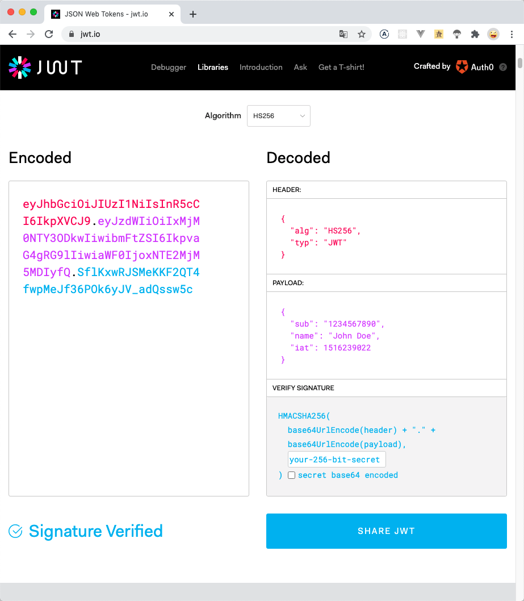

# JWT - JSON Web Token

<ArticleMeta />

## 什么是 JWT

> JSON Web 令牌（JWT）是一个开放标准（RFC 7519），它定义了一种紧凑且自包含的方式，用于在各方之间安全地将信息作为 JSON 对象传输。由于此信息是经过数字签名的，因此可以被验证和信任。

## JWT 的格式

JSON Web 令牌以紧凑的形式由三部分组成，这些部分由点（`.`）分隔，分别是：

- Header
- Payload
- Signature

因此，JWT 通常如下所示：

`xxxxx.yyyyy.zzzzz`

### Header

通常由两部分组成：类型和签名算法。

#### typ

建议值为`"JWT"`，始终保持大写字母拼写。

#### alg

所使用的签名算法


一个完整的`Header`可能是：

```json
{
  "alg": "HS256",
  "typ": "JWT"
}
```

此`JSON`被`Base64Url`编码以形成`JWT`的第一部分。

### Payload

载荷中可以包含三种类型：`Registered Claim Names`（标准中的注册声明）、`Public Claim Names`（公共的声明）、`Private Claim Names`（私有的声明）。

#### 标准中的注册声明

```json
{
	"iss": "Issuer", # 发布者
	"sub": "Subject",
	"aud": "Audience", # 接收者
	"iat": 1600416046, # 签发时间，NumericDate值的数字
	"nbf": 1600416046, # 最早有效时间，NumericDate值的数字
	"exp": 1600416046, # 最晚有效时间，NumericDate值的数字
	"jti": "JWT ID", # 唯一标识
}
```

::: tip
挟带有效时间范围是极好的行为，这样可以避免重放攻击。
:::

#### 公共的声明
公共的声明可以添加任何的信息，一般添加用户的相关信息或其他业务需要的必要信息。

#### 私有的声明
::: warning
不建议添加敏感信息，因为该部分在客户端可解密。
:::

私有声明是提供者和消费者所共同定义的声明，一般不建议存放敏感信息，因为base64是对称解密的，意味着该部分信息可以归类为明文信息。

综上，一个有效的`Payload`可能是：

```json
{
  "iat": 1600416046,
  "nbf": 1600416046,
  "exp": 1601236177,
  "name": "Anonymity94"
}
```

然后，对`Payload`进行`Base64Url`编码，以形成`JWT`的第二部分。

### Signature

`JWT`的第三部分是一个签名信息，这个签名信息由三部分组成：

- `Base64`后的`Header`
- `Base64`后的`Payload`
- 密钥

如果使用`HMAC SHA256`算法，那么签名示例如下：
```
HMACSHA256(
  base64UrlEncode(header) + "." +
  base64UrlEncode(payload),
  secret
)
```

可以使用[jwt.io Debugger](https://jwt.io/)进行解码，验证和生成JWT。



## 不安全的 JWT

- 忽略`alg`

```sh
{
	"alg": "none"
}
```

- 忽略有效时间范围参数

- 载荷中存放敏感信息

```json
{
	"password": "123456" # 例如，存放密码
}
```

## 示例

### JAVA

请采用官方包：[java-jwt](https://mvnrepository.com/artifact/com.auth0/java-jwt)。
在实际开发中，碰到过对接方使用了别的`jar`包，相同的数据和密钥，计算出来的签名不一致。后来发现是第三方包里面修改了算法，导致计算的签名不一致。

### Node.js

```js
const jwt = require('jsonwebtoken');
const secret = 'ZCdPWrxiaF5M_WCFFpRw7MshmjjQyNeX';
const token = jwt.sign(
  {
    iat: 1600416046,
    nbf: 1600416046,
    exp: 1601236177,
    user_id: '49EAF512DD5BDC08DF8EA4462782C8D2',
  },
  secret,
  {
    header: {
      alg: 'HS256',
      typ: 'JWT',
    },
  },
);
```

## 参考

- [JWT rfc](https://tools.ietf.org/html/rfc7519)
- [jwt.io](https://jwt.io/)
