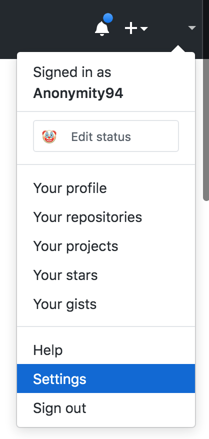
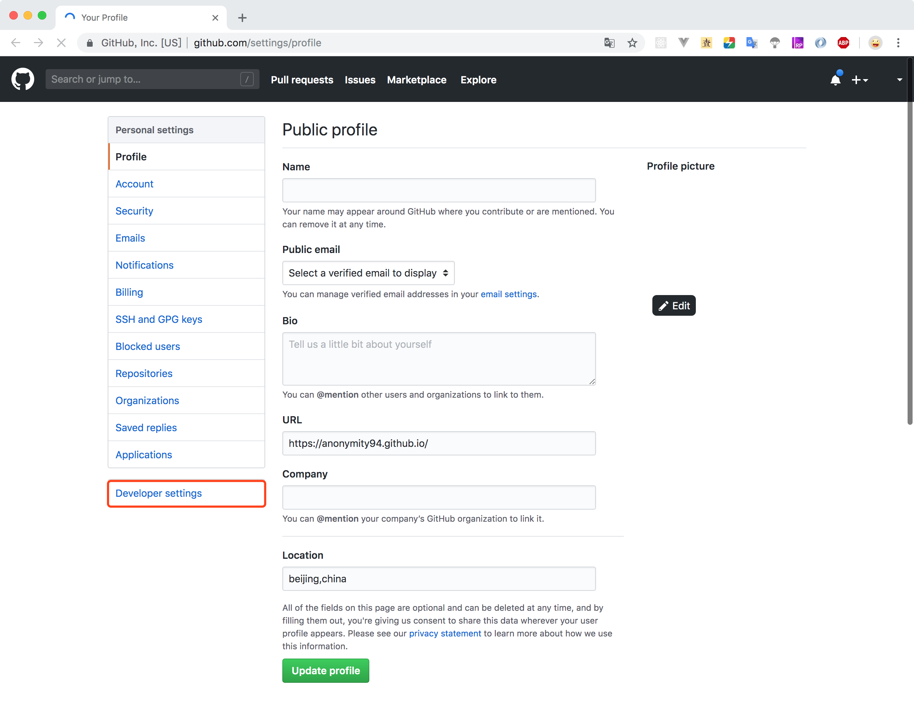
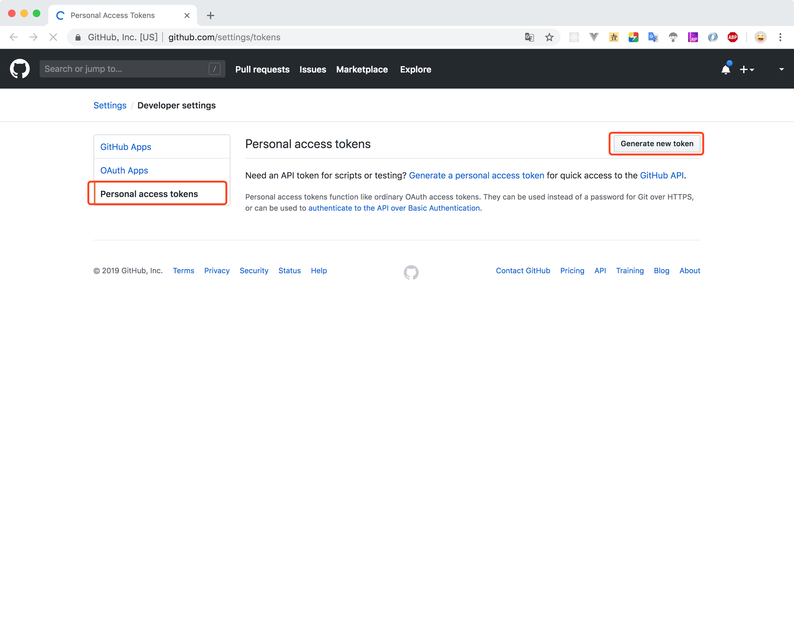

# 利用 GitHub API 学习 GraphQL

<ArticleMeta />

<style lang="less" scoped>
.hero {
    background: #171E26;
    height: 200px;
    position: relative;
    display: flex;
    justify-content: center;
    align-items: center;
    &:before {
        background: url(https://graphql.cn/img/graph-wash.png) repeat center center;
        content: '';
        height: 100%;
        position: absolute;
        top: 0;
        width: 100%;
    }
    .logo {
        z-index: 1;
        img {
            margin: 0 auto;
            display: block;
            width: 90px;
            height: 90px;
        }
        img {
          box-shadow: none !important;
        }
        p {
            color: #E10098;
            margin: 0;
            margin-top: 0.25em;
            font-size: 30px;
            line-height: 1;
        }
    }
}
</style>
<div class="hero">
    <div class="logo">
        
        <p>GraphQL</p>
    </div>
</div>

GitHub 在 API v4 中选择了 GraphQL，我们可以利用 GitHub 现有的 API 功能来学习 GraphQL 。

## [GraphQL](https://graphql.cn/)是什么？

> 一种用于 API 的查询语言。
>
> GraphQL 既是一种用于 API 的查询语言也是一个满足你数据查询的运行时。 GraphQL 对你的 API 中的数据提供了一套易于理解的完整描述，使得客户端能够准确地获得它需要的数据，而且没有任何冗余，也让 API 更容易地随着时间推移而演进，还能用于构建强大的开发者工具。

## 获取 Token

<p></p>





## 使用 cURL

```sh
curl -H "Authorization: bearer 你的token" -X POST -d " \
 { \
   \"query\": \"query { viewer { login }}\" \
 } \
" https://api.github.com/graphql
```

返回结果：

```sh
{"data":{"viewer":{"login":"Anonymity94"}}}
```

## 使用 GitHub GraphQL Explorer

> [GraphQL Explorer](https://developer.github.com/v4/explorer/)

使用 GitHub 授权登录即可使用 GitHub 提供的 GraphQL Explorer 功能。

## 查询和变更

> 官网介绍：[https://graphql.cn/learn/queries/](https://graphql.cn/learn/queries/)

### 字段（Fields）

```
{
    viewer {
        login
        avatarUrl
        repositories {
            totalCount
        }
    }
}
```

```json
{
  "data": {
    "viewer": {
      "login": "Anonymity94",
      "avatarUrl": "https://avatars0.githubusercontent.com/u/13148447?v=4",
      "repositories": {
        "totalCount": 64
      }
    }
  }
}
```

查询和结果拥有几乎一样的结构。

GraphQL 查询能够遍历相关对象及其字段，使得客户端可以一次请求查询大量相关数据，而不像传统 REST 架构中那样需要多次往返查询。

### 参数（Arguments）
在类似 REST 的系统中，你只能传递一组简单参数 —— 请求中的 query 参数和 URL 段。但是在 GraphQL 中，每一个字段和嵌套对象都能有自己的一组参数，从而使得 GraphQL 可以完美替代多次 API 获取请求。甚至你也可以给 标量（scalar）字段传递参数，用于实现服务端的一次转换，而不用每个客户端分别转换。

```
{
  viewer {
    repository(name: "anonymity94.github.io"){
      id
      name
      description
    }
  }
}
```

```json
{
  "data": {
    "viewer": {
      "repository": {
        "id": "MDEwOlJlcG9zaXRvcnk0OTM1NTg3OA==",
        "name": "Anonymity94.github.io",
        "description": "访问地址"
      }
    }
  }
}
```

### 别名（Aliases）
发请求给 GraphQL 服务器时，可以给字段起别名，返回的数据中的对应字段就用这个别名作为属性名。

```{3,5}
{
  viewer {
    userName: login 
    repository(name: "anonymity94.github.io"){
      repositoryId: id
      name
      description
    }
  }
}
```
```json{4,6}
{
  "data": {
    "viewer": {
      "userName": "Anonymity94",
      "repository": {
        "repositoryId": "MDEwOlJlcG9zaXRvcnk0OTM1NTg3OA==",
        "name": "Anonymity94.github.io",
        "description": "访问地址"
      }
    }
  }
}
```

### 片段（Fragments）
片段: 可复用单元。片段使你能够组织一组字段，然后在需要它们的的地方引入。
片段的 on 后面的字段是接口（Interface）或类（Object）

```
{
  viewer {
    ...userInfo
  }
  user(login: "Anonymity94") {
    ...userInfo
  }
}

fragment userInfo on User{
  id
  name
  updatedAt
}
```

```json
{
  "data": {
    "viewer": {
      "id": "MDQ6VXNlcjEzMTQ4NDQ3",
      "name": null,
      "updatedAt": "2019-08-28T12:09:49Z"
    },
    "user": {
      "id": "MDQ6VXNlcjEzMTQ4NDQ3",
      "name": null,
      "updatedAt": "2019-08-28T12:09:49Z"
    }
  }
}
```

### 操作名称（Operation Name）
**操作类型** 可以是 `query`、`mutation` 或 `subscription`。只有 `query` 可以省略。

**操作名称** 是你的操作的有意义和明确的名称。它仅在有多个操作的文档中是必需的，但我们鼓励使用它，因为它对于调试和服务器端日志记录非常有用。GraphQL 的查询和变更名称，以及片段名称，都可以成为服务端侧用来识别不同 GraphQL 请求的有效调试工具。

### 变量（Variables）

```
query customQuery($login: String!) {
  user(login: $login) {
    id
    name
    updatedAt
  }
}
```
Query Variables:
```json
{ "login": "Anonymity94" }
```

Result:
```json
{
  "data": {
    "user": {
      "id": "MDQ6VXNlcjEzMTQ4NDQ3",
      "name": null,
      "updatedAt": "2019-08-28T12:09:49Z"
    }
  }
}
```

对于**简单参数**或**固定参数**，可以写在查询字符串内。

对于**动态或者复杂的参数**，我们可以作为分离的字典传进去。变量前缀必须为 `$`，后跟其类型。

所有声明的变量都必须是标量、枚举型或者输入对象类型，由 `Schema` 确定。

变量定义可以是**可选的**或者**必要的**。上例中，`String` 后有有 `!`，因此其是必要的。但是如果你传递变量的字段可以为空参数，那变量就是可选的。

### 指令（Directives）
```json
query customQuery($login: String!, $withFollowing: Boolean!) {
  user(login: $login) {
    id
    name
    updatedAt
    following(first: 10) @include(if: $withFollowing) {
      edges {
        node {
          id
          name
        }
      }
    }
  }
}
```

Query Variables:
```json
{ 
  "login": "Anonymity94", 
  "withFollowing": true 
}
```

```json
{
  "data": {
    "user": {
      "id": "MDQ6VXNlcjEzMTQ4NDQ3",
      "name": null,
      "updatedAt": "2019-08-28T12:09:49Z",
      "following": {
        "edges": [
          {
            "node": {
              "id": "MDQ6VXNlcjI0Nzk5Njc=",
              "name": "Robin Wieruch"
            }
          },
          {
            "node": {
              "id": "MDQ6VXNlcjkwNTQzNA==",
              "name": "Ruan YiFeng"
            }
          },
          {
            "node": {
              "id": "MDQ6VXNlcjg0MTYyNQ==",
              "name": "老雷"
            }
          }
        ]
      }
    }
  }
}
```
指令可以变量动态地改变我们查询的结构。

一个指令可以附着在字段或者片段包含的字段上，然后以任何服务端期待的方式来改变查询的执行。

GraphQL 支持的指令有两个：
- **@include(if: Boolean)** 仅在参数为 true 时，包含此字段。
- **@skip(if: Boolean)** 如果参数为 true，跳过此字段。

尝试修改上面的变量，传递 `false` 给 `withFollowing`，看看结果的变化吧~

### 变更（Mutations）

### 内联片段（Inline Fragments）
