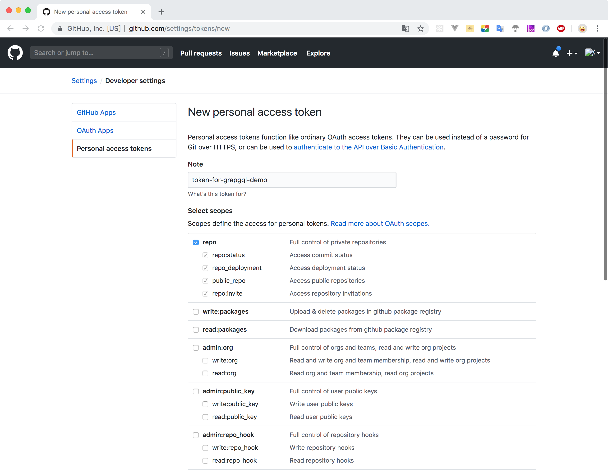

# 利用 GitHub API 学习 GraphQL

<ArticleMeta />

<style lang="less" scoped>
.hero {
    background: #171E26;
    height: 200px;
    position: relative;
    display: flex;
    justify-content: center;
    align-items: center;
    &:before {
        background: url(https://graphql.cn/img/graph-wash.png) repeat center center;
        content: '';
        height: 100%;
        position: absolute;
        top: 0;
        width: 100%;
    }
    .logo {
        z-index: 1;
        img {
            margin: 0 auto;
            display: block;
            width: 90px;
            height: 90px;
        }
        p {
            color: #E10098;
            margin: 0;
            margin-top: 0.25em;
            font-size: 30px;
            line-height: 1;
        }
    }
}
</style>
<div class="hero">
    <div class="logo">
        
        <p>GraphQL</p>
    </div>
</div>

GitHub 在 API v4 中选择了 GraphQL，我们可以利用 GitHub 现有的 API 功能来学习 GraphQL 。

## [GraphQL](https://graphql.cn/)是什么？

> 一种用于 API 的查询语言。
>
> GraphQL 既是一种用于 API 的查询语言也是一个满足你数据查询的运行时。 GraphQL 对你的 API 中的数据提供了一套易于理解的完整描述，使得客户端能够准确地获得它需要的数据，而且没有任何冗余，也让 API 更容易地随着时间推移而演进，还能用于构建强大的开发者工具。

## 获取 Token

<p></p>




## 使用 cURL

```sh
curl -H "Authorization: bearer 你的token" -X POST -d " \
 { \
   \"query\": \"query { viewer { login }}\" \
 } \
" https://api.github.com/graphql
```

返回结果：

```sh
{"data":{"viewer":{"login":"Anonymity94"}}}
```

## 使用 GitHub GraphQL Explorer

> [GraphQL Explorer](https://developer.github.com/v4/explorer/)

使用 GitHub 授权登录即可使用 GitHub 提供的 GraphQL Explorer 功能。

## 查询和变更

> 官网介绍：[https://graphql.cn/learn/queries/](https://graphql.cn/learn/queries/)

### 字段（Fields）

### 参数（Arguments）

### 别名（Aliases）

### 片段（Fragments）

### 操作名称（Operation Name）

### 变量（Variables）

### 指令（Directives）

### 变更（Mutations）

### 内联片段（Inline Fragments）
