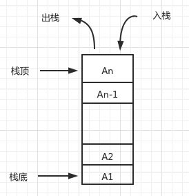
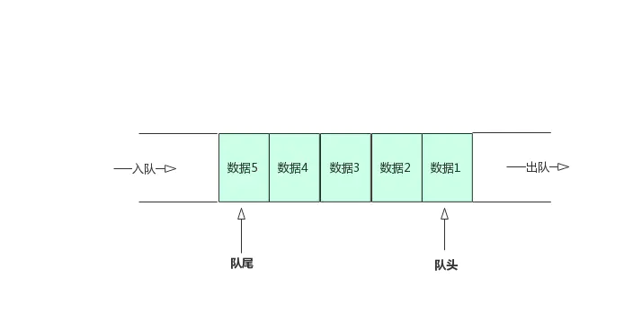

# 重学《JavaScript 高级程序设计(第 4 版)》

## 第三章 语言基础

### 3.4 数据类型

#### 3.4.3 Null 类型

> Null 类型同样只有一个值，即特殊值 null。
>
> 逻辑上讲，null 值表示一个空对象指针，这也是给 typeof 传一个 null 会返回"object"的原因

```js
typeof null // "object"
```

#### 3.4.5 Number 类型

```js
parseInt('1234blue') // 1234
parseInt('') // NaN

parseInt('10', 2) // 2，按 2 进制解析
```

#### 3.4.6 String 类型

```js
let num = 10
console.log(num.toString()) // "10"
console.log(num.toString(2)) // "1010"
console.log(num.toString(8)) // "12"
console.log(num.toString(10)) // "10"
console.log(num.toString(16)) // "a"
```

### 3.5 操作符

#### 3.5.5 指数操作符

`Math.pow()` 现在有了自己的操作符 `**`，结果是一样的:

```js
console.log(Math.pow(3, 2); // 9
console.log(3 ** 2); // 9
```

指数赋值操作符 `**=`

```js
let squared = 3
squared **= 2
console.log(squared) // 9
```

## 第 6 章 集合引用类型

### 6.2 Array

> [MDN - Array](https://developer.mozilla.org/zh-CN/docs/Web/JavaScript/Reference/Global_Objects/Array)

#### 6.2.1 创建数组

`from()`: 用于将类数组结构转换为数组实例。

```js
// 字符串会被拆分为单字符数组
console.log(Array.from('Matt')) // ["M", "a", "t", "t"]

// Array.from()对现有数组执行浅复制
const a1 = [1, 2, 3, 4]
const a2 = Array.from(a1)
console.log(a1) // [1, 2, 3, 4]
alert(a1 === a2) // false

// Array.from()还接收第二个可选的映射函数参数
const a1 = [1, 2, 3, 4]
const a2 = Array.from(a1, (x) => x ** 2)
// 可以接收第三个可选参数，用于指定映射函 数中 this 的值。但这个重写的 this 值在箭头函数中不适用
const a3 = Array.from(
  a1,
  function(x) {
    return x ** this.exponent
  },
  { exponent: 2 }
)
console.log(a2) // [1, 4, 9, 16]
console.log(a3) // [1, 4, 9, 16]
```

`of()`: 用于将一组参数转换为数组实例。

```js
console.log(Array.of(1, 2, 3, 4)) // [1, 2, 3, 4]
```

```js
function list() {
  return Array.prototype.slice.call(arguments)
}

const list1 = list(1, 2, 3) // [1, 2, 3]
```

#### 6.2.5 迭代器方法

- `keys()`: 返回数组索引的迭代器
- `values()`: 返回数组元素的迭代器
- `entries()`: 返回索引/值对的迭代器

```js
const a = ['foo', 'bar', 'baz', 'qux']
// 因为这些方法都返回迭代器，所以可以将它们的内容
// 通过Array.from()直接转换为数组实例
const aKeys = Array.from(a.keys())
const aValues = Array.from(a.values())
const aEntries = Array.from(a.entries())
console.log(aKeys) // [0, 1, 2, 3]
console.log(aValues) // ["foo", "bar", "baz", "qux"]
console.log(aEntries) // [[0, "foo"], [1, "bar"], [2, "baz"], [3, "qux"]]
```

#### 6.2.6 复制和填充方法

- `fill()`

```js
const zeroes = [0, 0, 0, 0, 0]
// 用 5 填充整个数组
zeroes.fill(5)
console.log(zeroes) // [5, 5, 5, 5, 5]
zeroes.fill(0) // 重置
// 用 6 填充索引大于等于 3 的元素
zeroes.fill(6, 3)
console.log(zeroes) // [0, 0, 0, 6, 6]
zeroes.fill(0) // 重置
// 用7填充索引大于等于1且小于3的元素
zeroes.fill(7, 1, 3)
console.log(zeroes) // [0, 7, 7, 0, 0];
zeroes.fill(0) // 重置
// 用8填充索引大于等于1且小于4的元素
// (-4 + zeroes.length = 1)
// (-1 + zeroes.length = 4)
zeroes.fill(8, -4, -1)
console.log(zeroes) // [0, 8, 8, 8, 0];
```

- `copyWithin()`

会按照指定范围浅复制数组中的部分内容，然后将它们插入到指 定索引开始的位置

#### 6.2.7 转换方法

> 如果数组中某一项是 null 或 undefined，则在 join()、toLocaleString()、 toString()和 valueOf()返回的结果中会以空字符串表示。

- `toLocaleString()`
- `toString()`
- `valueOf()`
- `join()`

#### 6.2.8 栈方法

栈是一种后进先出(LIFO，Last-In-First-Out)的结构。



- `push()`: 推入，返回数组新长度
- `pop()`: 删除数组的最后一项，并返回

```js
const colors = ['black', 'red']

colors.push('green')
console.log(colors) // ['black', 'red', 'green']

let item = colors.pop()
console.log(item) // green
```

#### 6.2.9 队列方法

队列以先进先出(FIFO，First-In-First-Out)形式限制访问。

队列在列表末尾添加数据，但从列表开头获取数据。



- `shift()`: 删除数组的第一项并返回，数组长度减 1
- `unshift()`: 数组开头添加任意多个值，返回新的数组长度

```js
const colors = ['black', 'red']
let item = colors.shift()

console.log(colors) // ['red']
console.log(item) // black

colors.unshift('green')
console.log(colors) // ["green", "red"]
```

#### 6.2.10 排序方法

- `reverse()`: 反向排序
- `sort()`: 默认情况下按字符串顺序升序排序

#### 6.2.11 操作方法

- `concat()` 在现有数组全部元素基础上创建一个新数组

```js
let colors = ['red', 'green', 'blue']
let newColors = ['black', 'brown']
let moreNewColors = {
  [Symbol.isConcatSpreadable]: true,
  length: 2,
  0: 'pink',
  1: 'cyan',
}
newColors[Symbol.isConcatSpreadable] = false
// 强制不打平数组
let colors2 = colors.concat('yellow', newColors)
// 强制打平类数组对象
let colors3 = colors.concat(moreNewColors)
console.log(colors) // ["red", "green", "blue"]
console.log(colors2) // ["red", "green", "blue", "yellow", ["black", "brown"]]
console.log(colors3) // ["red", "green", "blue", "pink", "cyan"]
```

- `slice()`: 返回数组下标 `>=` 开始索引并且 `<` 结束索引的所有元素，这个操作不影响原始数组

```js
let colors = ['red', 'green', 'blue', 'yellow', 'purple']

let colors2 = colors.slice(1)
console.log(colors2) // ['green', 'blue', 'yellow', 'purple']

let colors3 = colors.slice(1, 4)
console.log(colors3) // ['green', 'blue', 'yellow']

// -2 + 5 = 3
// -1 + 5 = 4
let colors4 = colors.slice(-2, -1)
console.log(colors4) // ['yellow']
```

- `splice()`: 主要目的是数组中插入元素

```js
// 删除
// 传入 2 个参数: 要删除的第一个元素的位置和要删除的元素数量
let colors = ['red', 'green', 'blue']
let removed = colors.splice(0, 1) // 删除第一项
console.log(colors) // ['green', 'blue']
console.log(removed) // ['red']
```

```js
// 插入
// 传入 3 个参数:开始位置、0(要删除的元素数量)和要插入的元素
let colors = ['red', 'green', 'blue']
removed = colors.splice(1, 0, 'yellow', 'orange')
console.log(colors) // ['red', "yellow", "orange",'green', 'blue']
console.log(removed) // 空数组[]
```

```js
// 替换
// 在删除元素的同时可以在指定位置插入新元素
// 同样要传入 3 个参数:开始位 置、要删除元素的数量和要插入的任意多个元素
let colors = ['red', 'green', 'blue']
// 删除下标为 1 的元素，并插入 2 个新的元素
removed = colors.splice(1, 1, 'yellow', 'orange')
console.log(colors) // ['red', "yellow", "orange", 'blue']
console.log(removed) // ['green']
```

#### 6.2.12 搜索和位置方法

- `indexOf()`: 返回要查找的元素在数组中的位置 || -1
- `lastIndexOf()`: 返回要查找的元素在数组中的位置 || -1
- `includes()`: 返回 `true` || `false`
- `find()`: 返回第一个匹配的元素
- `findIndex()`: 返回第一个匹配元素的索引

```js
const people = [
  {
    name: 'Matt',
    age: 27,
  },
  {
    name: 'Nicholas',
    age: 29,
  },
]

console.log(people.find((element, index, array) => element.age < 28)) // {name: "Matt", age: 27}
console.log(people.findIndex((element, index, array) => element.age < 28)) // 0
console.log(people.includes((element, index, array) => element.age < 28)) // false
```

#### 6.2.13 迭代方法

- `every()`: 对数组每一项都运行传入的函数，如果对每一项函数都返回 `true`，则这个方法返回 `true`。
- `filter()`: 对数组每一项都运行传入的函数，函数返回 `true` 的项会组成数组之后返回。
- `forEach()`: 对数组每一项都运行传入的函数，没有返回值。
- `map()`: 对数组每一项都运行传入的函数，返回由每次函数调用的结果构成的数组。
- `some()`: 对数组每一项都运行传入的函数，如果有一项函数返回 `true`，则这个方法返回 `true。`

#### 6.2.14 归并方法

- `reduce()`
- `reduceRight()`

```js
let values = [1, 2, 3, 4, 5]
let sum = values.reduce((prev, cur, index, array) => prev + cur, 0)
console.log(sum) // 15
```

### 6.4 Map

> [MDN - Map](https://developer.mozilla.org/zh-CN/docs/Web/JavaScript/Reference/Global_Objects/Map)

与 `Object` 类型的一个主要差异是，`Map` 实例会维护键值对的插入顺序，因此可以根据插入顺序执行迭代操作。

- `Map.prototype.size`
- `Map.prototype.clear()`
- `Map.prototype.delete()`
- `Map.prototype.entries()`
- `Map.prototype.forEach()`
- `Map.prototype.get()`
- `Map.prototype.has()`
- `Map.prototype.keys()`
- `Map.prototype.set()`
- `Map.prototype.values()`

可通过 `for .. of` 方法进行迭代

```js
const m = new Map([
  ['key1', 'val1'],
  ['key2', 'val2'],
  ['key3', 'val3'],
])

console.log(m.entries())
// MapIterator {"key1" => "val1", "key2" => "val2", "key3" => "val3"}

for (let [key, value] of m.entries()) {
  console.log(key)
  console.log(value)
}
```

`Map` 可以和数组互相转换

```js
let kvArray = [
  ['key1', 'value1'],
  ['key2', 'value2'],
]

// 使用常规的Map构造函数可以将一个二维键值对数组转换成一个Map对象
let myMap = new Map(kvArray)

myMap.get('key1') // 返回值为 "value1"

// 使用Array.from函数可以将一个Map对象转换成一个二维键值对数组
console.log(Array.from(myMap)) // 输出和kvArray相同的数组

// 更简洁的方法来做如上同样的事情，使用展开运算符
console.log([...myMap])

// 或者在键或者值的迭代器上使用Array.from，进而得到只含有键或者值的数组
console.log(Array.from(myMap.keys())) // 输出 ["key1", "key2"]
```
