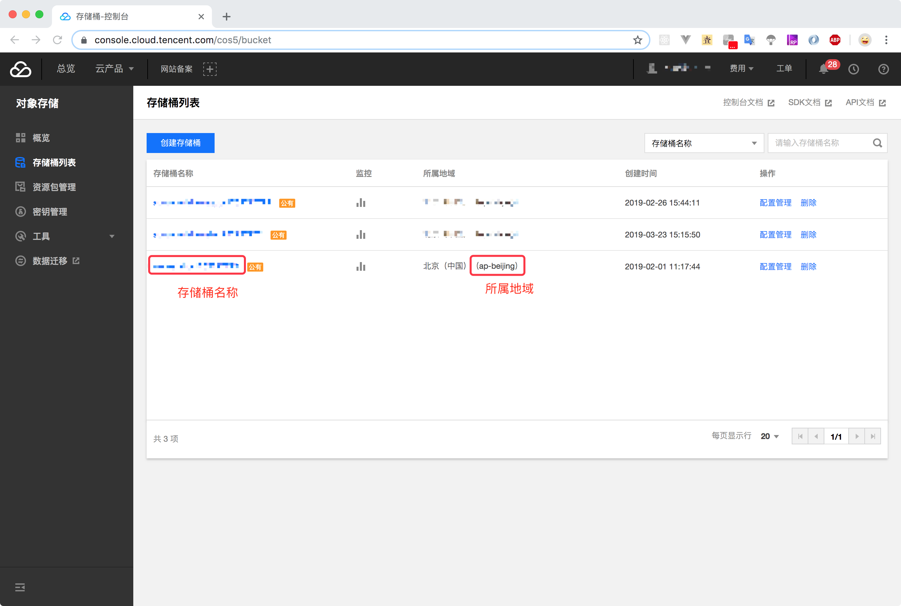
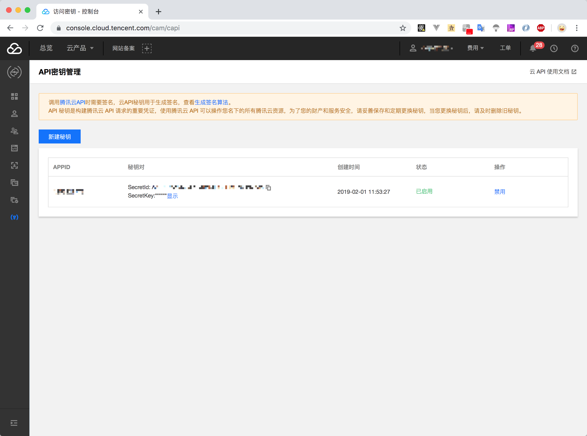

# 静态资源上传至腾讯云进行加速

<ArticleMeta />

## 背景

之前的一个vue项目，有个1M带宽的测试服务器，每次构建发布后预览起来都特别慢。所以把构建后的静态资源都丢到腾讯云上去加速了。这里把处理流程简单的记录下。

> 参考资料：<br/>
> [腾讯云 Node.js SDK 文档](https://cloud.tencent.com/document/product/436/8629)<br/>
> [COS 术语信息](https://cloud.tencent.com/document/product/436/7751#.E6.9C.AF.E8.AF.AD.E4.BF.A1.E6.81.AF)

## 创建存储桶
不做赘述。

## 获取存储桶名称和所属地域
> [存储桶列表](https://console.cloud.tencent.com/cos5/bucket)



- 存储桶名称 - Bucket
- 所属地域 - Region

## 获取 SecretId 和 SecretKey
> [API密钥管理](https://console.cloud.tencent.com/cam/capi)



## 编写上传脚本

安装依赖 `npm i cos-nodejs-sdk-v5 -D`

```javascript
/**
 * file: uploadToCDN.js
 */

const COS = require('cos-nodejs-sdk-v5');
const fs = require('fs');
const path = require('path');

const config = {
  SecretId: '你的SecretId',
  SecretKey: '你的SecretKey',
  Bucket: '存储桶的名称',
  Region: '存储桶的所属地域'
};

// web 打包后的路径（相对地址或绝对地址都行）
// uploadToCDN.js 放在根目录下了，所以这里直接使用了相对路径
const webDistPath = './dist/static';

// 创建实例
const cos = new COS({
  SecretId: config.SecretId,
  SecretKey: config.SecretKey,
  // 可选参数
  FileParallelLimit: 3, // 控制文件上传并发数
  ChunkParallelLimit: 8, // 控制单个文件下分片上传并发数，在同园区上传可以设置较大的并发数
  ChunkSize: 1024 * 1024 * 8, // 控制分片大小，单位 B，在同园区上传可以设置较大的分片大小
  Proxy: ''
});

let fileList = [];

// 1. 获取 bucket 中的所有文件列表
function getBucket() {
  cos.getBucket(
    {
      Bucket: config.Bucket,
      Region: config.Region
    },
    function(err, data) {
      fileList = data.Contents.map(item => ({ Key: item.Key }));
      deleteMultipleObject();
    }
  );
}

// 2. 批量删除多个文件
function deleteMultipleObject() {
  if (fileList.length === 0) {
    console.log('没有文件，不需要删除');
    return;
  }
  cos.deleteMultipleObject(
    {
      Bucket: config.Bucket,
      Region: config.Region,
      Objects: fileList
    },
    function(err, data) {
      console.log(err || data);
      if (!err) {
        console.log('删除成功');
        // 上传新的文件
        putObject();
      }
    }
  );
}

// 3. 获取打包后新的文件列表
function getNewFiles(dir = webDistPath) {
  var results = [];
  var list = fs.readdirSync(dir);
  list.forEach(function(item) {
    const relativePath = dir + '/' + item;
    const absolutePath = path.resolve(__dirname, relativePath);
    var stat = fs.statSync(relativePath);
    if (stat && stat.isDirectory()) {
      results = results.concat(getNewFiles(relativePath));
    } else {
      results.push({
        relativePath,
        absolutePath
      });
    }
  });

  return results;
}

// 4. 文件夹内的文件批量上传至 bucket 中
function putObject() {
  const newFileList = getNewFiles();
  if (newFileList.length === 0) {
    return;
  }

  let fileLength = newFileList.length;

  newFileList.forEach(file => {
    cos.putObject(
      {
        Bucket: config.Bucket,
        Region: config.Region,
        Key: file.relativePath,
        // 格式1. 传入文件内容
        // Body: fs.readFileSync(filepath),
        // 格式2. 传入文件流，必须需要传文件大小
        Body: fs.createReadStream(file.absolutePath),
        ContentLength: fs.statSync(file.absolutePath).size,
        SliceSize: 1024 * 1024,
        onProgress: function(info) {
          var percent = parseInt(info.percent * 10000) / 100;
          var speed = parseInt((info.speed / 1024 / 1024) * 100) / 100;
          console.log('进度：' + percent + '%; 速度：' + speed + 'Mb/s;');
        },
        onFileFinish: function(err, data, options) {
          console.log(options.Key + ' 上传' + (err ? '失败' : '完成'));
        }
      },
      function(err, data) {
        console.log(err || data);
        if (!err) {
          fileLength--;
          console.log(`剩余${fileLength}个文件`);
        }
        if (fileLength === 0) {
          console.log('❤❤❤❤❤❤❤❤❤❤❤❤');
          console.log('✅ 全部上传完成');
          console.log('❤❤❤❤❤❤❤❤❤❤❤❤');
        }
      }
    );
  });
}

;(function init() {
  getBucket();
})();
```

## 修改 `package.json`

安装依赖 `npm i cross-env -D`

```json
"scripts": {
  ...
  "build": "cross-env APP_TYPE=production node build/build.js",
  "build-test": "cross-env APP_TYPE=test node build/build.js",
  "cdn": "node uploadToCDN.js",
  ...
},
```

## 修改 `assetsPublicPath`

``` js{12}
let assetsPublicPath = '/'
// 测试环境下，使用CDN
if(process.env.APP_TYPE === 'test') {
  assetsPublicPath = 'https://*****************.myqcloud.com/dist/'
}

build: {
  env: require('./prod.env'),
  index: path.resolve(__dirname, '../dist/index.html'),
  assetsRoot: path.resolve(__dirname, '../dist'),
  assetsSubDirectory: 'static',
  assetsPublicPath,
  productionSourceMap: true,
  // Gzip off by default as many popular static hosts such as
  // Surge or Netlify already gzip all static assets for you.
  // Before setting to `true`, make sure to:
  // npm install --save-dev compression-webpack-plugin
  productionGzip: false,
  productionGzipExtensions: ['js', 'css'],
  // Run the build command with an extra argument to
  // View the bundle analyzer report after build finishes:
  // `npm run build --report`
  // Set to `true` or `false` to always turn it on or off
  bundleAnalyzerReport: process.env.npm_config_report
},
```

## 修改 webpack 构建脚本

`build/build.js`

```javascript{16-18,38-51}
require('./check-versions')()

process.env.NODE_ENV = 'production'

var ora = require('ora')
var rm = require('rimraf')
var path = require('path')
var chalk = require('chalk')
var webpack = require('webpack')
var config = require('../config')
var webpackConfig = require('./webpack.prod.conf')

var spinner = ora('building for production...')
spinner.start()

function exec (cmd) {
  return require('child_process').execSync(cmd).toString().trim()
}

rm(path.join(config.build.assetsRoot, config.build.assetsSubDirectory), err => {
  if (err) throw err
  webpack(webpackConfig, function (err, stats) {
    spinner.stop()
    if (err) throw err
    process.stdout.write(stats.toString({
      colors: true,
      modules: false,
      children: false,
      chunks: false,
      chunkModules: false
    }) + '\n\n')

    console.log(chalk.cyan('  Build complete.\n'))
    console.log(chalk.yellow(
      '  Tip: built files are meant to be served over an HTTP server.\n' +
      '  Opening index.html over file:// won\'t work.\n'
    ))

    if (process.env.APP_TYPE !== 'test'){
      return;
    }
    // 上传cdn
    const uplaodSpinner = ora('upload file ...')
    console.log(chalk.cyan('  Start upload file to Tencent bucket.\n'))
    uplaodSpinner.start()

    // 执行上传脚本
    exec('npm run cdn')
    
    uplaodSpinner.stop()
    console.log(chalk.cyan('  upload complete.\n'))
  })
})
```

## Done!

- 构建生成环境：`npm run build`
- 构建测试环境：`npm run build-test`