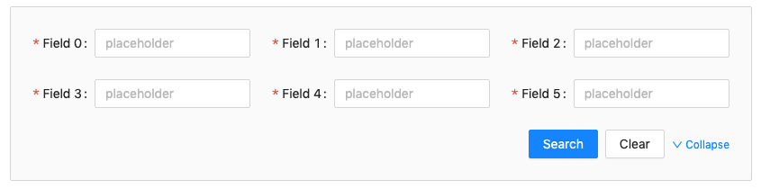
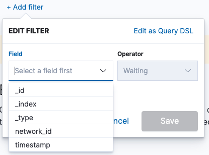
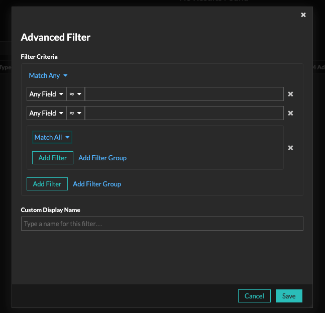
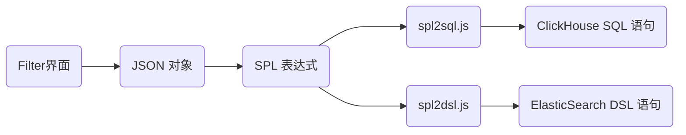

# 使用 DSL 实现自定义 Filter 查询

## DSL 初识

`DSL` 即 `「Domain Specific Language」`，领域专用语言。

## 领域应用

- [Splunk SPL](https://docs.splunk.com/Documentation/Splunk/8.1.2/SearchReference/Abstract)
- [Elasticsearch DSL](https://www.elastic.co/guide/en/elasticsearch/reference/7.8/query-dsl.html)

## Form 表单 vs. Filter 过滤

### Form 表单



由于我们的产品是一个类 `NPM` 的产品，充斥着网络流量解析的各种参数，由于传统的 `Form` 表单无法支持 `或` 查询，给界面的跳转、下钻分析造成了极大的不便。


### Filter 过滤

在调研业界标杆产品中，发现使用 `Filter` 自定义组合查询条件十分方便。


- Kibana



- ExtraHop




### 两者异同

| 功能点                           | Form | Filter | 备注                                  |
| -------------------------------- | ---- | ------ | ------------------------------------- |
| 基本的查询                       | √    | √      |                                       |
| 与查询                           | √    | √      | `a=1 AND b=2`                         |
| 或查询                           | X    | √      | `a=1 OR a=2`                          |
| 关系操作符查询，例如：大于、小于 | √    | √      | `a>1`                                 |
| 范围性查询，例如：`10-20`        | √    | √      | 可通过组合实现<br />`a>=10 AND a=<20` |
| 多值查询，例如：`80,8080`        | √    | √      | 可通过组合实现<br />`a=80 OR a=8080`  |


## PEG.js

`PEG.js` 是 `JavaScript` 的简单解析器生成器，它会将我们用 `PEG.js` 语法编写的文件转换为可直接运行的 `parser`。


## 转换思路



### Filter 界面

界面设计可以参考 `ExtraHop` 的实现。上面有截图。


### JSON 对象

界面操作生成一个 `json`, 结构定义为 `IFilterCondition`（*具体定义见伪代码实现*）

`json` 示例为：

```ts
const filterArr = [
  { field: "name", operator: "=", operand: "张三" },
  {
    operator: "OR",
    group: [
      {
        field: "province",
        operator: "=",
        operand: "北京"
      },
      {
        field: "province",
        operator: "=",
        operand: "山东"
      }
    ]
  }
]
```

通过一个方法把 `json` 转成 `SPL`。

```ts
const filterCondition2Spl = (filter: IFilter) => {
  // json 转成 spl
};

const filterSpl = filterCondition2Spl(filterArr);
// name = "张三" AND (province = "北京" OR province = "山东")
```

::: details 伪代码实现

`TS` 定义可以为：

```tsx
// index.tsx
import React from 'react';
interface IAdvancedFilterProps {
  visible: boolean;
  fields: IField[];
  condition?: IFilterGroup | IFilter;
  onFinish: (filter: IFilterGroup) => void;
  onCancel: () => void;
}

const AdvancedFilter: FC<IAdvancedFilterProps> = ({
  visible,
  fields,
  condition,
  onFinish,
  onCancel,
}) => {
  return (<div> something </div>)
}

export default AdvancedFilter;
```

```ts
// typings.ts
/**
 * 字段的类型
 */
export enum EFieldType {
  'IPV4' = 'IPv4',
  'IPV6' = 'IPv6',
  'ARRAY' = 'Array',
  'ARRAY<IPv4>' = 'Array<IPv4>',
  'ARRAY<IPv6>' = 'Array<IPv6>',
}
/**
 * 操作数（字段值）类型
 */
export enum EFieldOperandType {
  /**
   * IP类型不可用在转sql中
   */
  'IP' = 'IP',
  'IPV4' = 'IPv4',
  'IPV6' = 'IPv6',
  'PORT' = 'port',
  'NUMBER' = 'number',
  'STRING' = 'string',
  'ENUM' = 'enum',
}
/**
 * 过滤的基本的等式
 */
export type IFilter = {
  id?: string;
  /**
   * 字段值
   */
  field: string;
  /**
   * 字段的名字
   */
  fieldText: string;
  type?: EFieldType;
  /**
   * 操作符号 
   */
  operator: EFilterOperatorTypes;
  operatorText?: string;
  /**
   * 操作数的值
   */
  operand?: string | number;
  /**
   * 操作数的名字
   * 枚举值可以显示名称
   */
  operandText?: string;
};
/**
 * 过滤组
 */
export type IFilterGroup = {
  id?: string;
  operator: EFilterGroupOperatorTypes;
  group: (IFilterGroup | IFilter)[];
};

export type IFilterCondition = (IFilterGroup | IFilter)[];

export enum EFilterGroupOperatorTypes {
  'AND' = 'AND',
  'OR' = 'OR',
  // 'NOT' = 'NOT',
}

/**
 * 操作符类型
 */
export enum EFilterOperatorTypes {
  EQ = '=',
  NEQ = '!=',
  GT = '>',
  EGT = '>=',
  LT = '<',
  ELT = '<=',
  LIKE = 'like',
  // IN = ' IN ',
  /**
   * 结果不为空
   */
  EXISTS = 'exists',
  /**
   * 结果为空
   */
  NOT_EXISTS = 'not_exists',
}

export interface IEnumObj {
  [propName: string]: string;
}

export interface List {
  label: string;
  value: string;
}

/**
 * 表格里面的枚举值
 */
export interface IEnumValue {
  value: string;
  text: string;
}

/**
 * 过滤条件中的字段
 */
export interface IField {
  title: string;
  dataIndex: string;
  /**
   * 字段的类型
   */
  type?: EFieldType;
  /**
   * 操作数的类型
   */
  operandType?: EFieldOperandType;
  enumValue?: IEnumValue[];
}

export interface ISelectOptionWithLabel {
  label: string;
  value: string;
}

/**
 * 搜索历史
 */
export interface ISearchHistory {
  /**
   * 根据过滤条件计算出来的 hash 值
   */
  id: string;
  /**
   * 搜索历史对外显示的文字
   */
  name: string;
  /**
   * 过滤条件
   */
  filter: (IFilter | IFilterGroup)[];
}

```
:::


### SPL 解析成 ClickHouse SQL

转换器 [spl2sql](https://github.com/Anonymity94/spl2sql)

由于 `ClickHouse` 对 `IPv4`、`IPv6`、`Array` 类型的字段有不同的查询转换方法，所以转换器中做了很多不同类型的硬编码。

```ts
try {
  const sql = splToSqlConverter.parse(filterSpl)
} catch (error) {
  console.log(error);
}
```

### SPL 解析成 Elasticsearch DSL

转换器 [spl2dsl](https://github.com/Anonymity94/spl2dsl)

```ts
try {
  const dsl = splToDslConverter.parse(filterSpl)
} catch (error) {
  console.log(error);
}
```

结果得到一个 `DSL query`，转换成 `base64`，配合 [ES Wrapper query](https://www.elastic.co/guide/en/elasticsearch/reference/7.10/query-dsl-wrapper-query.html)即可。

## 参考

- [PEG.js](https://pegjs.org/)
- [Splunk SPL](https://docs.splunk.com/Documentation/Splunk/8.1.2/SearchReference/Abstract)
- [ClickHouse Query](https://clickhouse.tech/docs/en/sql-reference/statements/select/)
- [ElasticSearch DSL](https://www.elastic.co/guide/en/elasticsearch/reference/7.8/query-dsl.html)
- [ExtraHop](https://www.extrahop.com/)