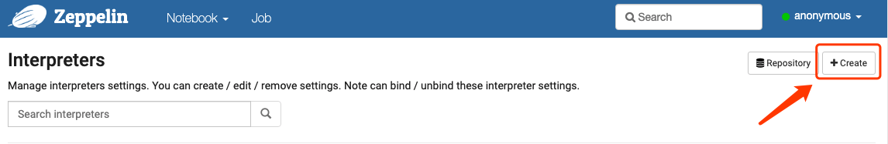
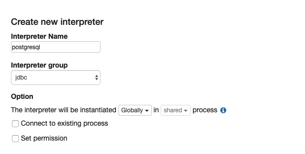
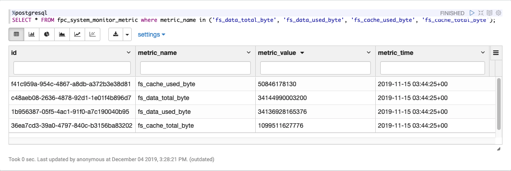
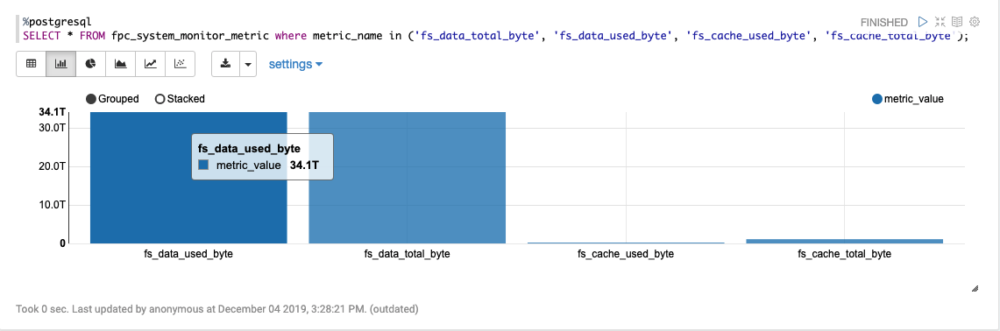

# Zeppelin

<ArticleMeta />

## JDBC 通用解释器
JDBC解释器允许您无缝地创建到任何数据源的JDBC连接。

在运行每个语句后，将立即应用插入，更新和升级。

到目前为止，已经通过以下测试：


### 创建一个新的JDBC解释器
如果你的`Zeppelin`有多个不同的数据源，此时你可以依托`JDBC`通用解释器创建不同的解释器，来更好的操作数据。

下面我们将创建一个`PostgreSQL`解释器。



### 填写解释器参数

- `Interpreter Name`：任何你想要用作别名的填充字段（如`postgresql`, `mysql`等）。请注意，此别名将用于`%interpreter_name`在段落中调用解释器
- `Interpreter group`：新建解释器的所属分组，这里选择`jdbc`



### 填写解释器`Properties`

#### Properties

| 属性             | 值                                    |
| ---------------- | ------------------------------------- |
| default.url      | jdbc:postgresql://10.0.0.162:5432/test |
| default.user     | \*\*\*                              |
| default.password | \*\*\*                          |

#### Dependencies

|              Artifact              | Excludes |
| :--------------------------------: | :------: |
| org.postgresql:postgresql:9.4.1211 |          |

## PostgreSQL

> 不建议使用Postgresql解释器，并将其合并到[JDBC Interpreter中](http://zeppelin.apache.org/docs/0.8.2/interpreter/jdbc.html)。您可以将它与JDBC Interpreter用作相同的功能。有关更多详细信息，请参见[Postgresql设置示例](http://zeppelin.apache.org/docs/0.8.2/interpreter/jdbc.html#postgres)。

### 运行段落

```sql
%postgresql
SELECT * FROM fpc_system_monitor_metric where metric_name in ('fs_data_total_byte', 'fs_data_used_byte', 'fs_cache_used_byte', 'fs_cache_total_byte');
```




## Elasticsearch

### 配置

| name                             | value         | 描述                                                         |
| :------------------------------- | :------------ | ------------------------------------------------------------ |
| elasticsearch.cluster.name       | elasticsearch | 群集名称                                                     |
| elasticsearch.host               | 10.0.0.188    | 集群中节点的主机                                             |
| elasticsearch.port               | 9200          | 连接端口 **（重要提示：它取决于客户端类型，传输或http）**     |
| elasticsearch.client.type        | http          | Elasticsearch（transport或http）的客户端类型 **（Important：端口取决于此值）** |
| elasticsearch.basicauth.password |               | 基本认证密码（http）                                         |
| elasticsearch.basicauth.username |               | 基本认证用户名（http）                                       |
| elasticsearch.result.size        | 10            | 搜索查询结果集的大小                                         |

### 运行段落

- `help`

```bash
%elasticsearch
help
```

```bash
Elasticsearch interpreter:
General format: <command> /<indices>/<types>/<id> <option> <JSON>
  - indices: list of indices separated by commas (depends on the command)
  - types: list of document types separated by commas (depends on the command)
Commands:
  - search /indices/types <query>
    . indices and types can be omitted (at least, you have to provide '/')
    . a query is either a JSON-formatted query, nor a lucene query
  - size <value>
    . defines the size of the result set (default value is in the config)
    . if used, this command must be declared before a search command
  - count /indices/types <query>
    . same comments as for the search
  - get /index/type/id
  - delete /index/type/id
  - index /index/type/id <json-formatted document>
    . the id can be omitted, elasticsearch will generate one
```

- 查看某个文档详情：`get /index/type/id`

```bash
%elasticsearch
get /i_npb-protocol-http-log-record-2019-12-04/_doc/uccFz24B6OCuWO87ZXRo
```

```json
{
  "referer": "",
  "request_data_len": 852,
  "origin": "",
  "response_data_len": 160,
  "src_ip": "172.18.0.102",
  "set_cookie": "",
  "content_type": "",
  "content_type_base64": "YXBwbGljYXRpb24vb2N0ZXQtc3RyZWFtO2NoYXJzZXQ9VVRGLTg\u003d",
  "host": "apilocate.amap.com",
  "accept_language": "",
  "dest_port": 80,
  "user_agent": "",
  "timestamp": 1575431265000,
  "uri_base64": "L21vYmlsZS9iaW5hcnk/b3V0cHV0PWJpbiZwb2xpY3k9MzEwMw\u003d\u003d",
  "request_data_context": "",
  "src_mac": "a8:9c:ed:88:3e:be",
  "method": "POST",
  "cookie": "",
  "level": "",
  "cookie_base64": "",
  "policy_name": "",
  "session_id": "2658387873",
  "uri": "/mobile/binary?output\u003dbin\u0026policy\u003d3103",
  "set_cookie_base64": "",
  "dst_mac": "e0:cc:7a:39:af:46",
  "user_agent_base64": "QU1BUF9Mb2NhdGlvbl9TREtfQW5kcm9pZCAzLjUuMA\u003d\u003d",
  "src_port": 38112,
  "dest_ip": "106.11.249.212",
  "xff": "",
  "response_data_context": "",
  "status": "200"
}
```

- 搜索：`search /indices/types <query>`

执行时会报错，错误如下，原因还没有找到。
::: warning
Error : JSONObject["total"] is not a long.
:::

- 插入文档：`index /index/type <json-formatted document>`

```bash
%elasticsearch
index /zeppelin/users {"name":"你好啊派大星"}
```

- 更新文档：`index /index/type/id <json-formatted document>`

```bash
%elasticsearch
index /zeppelin/users/Tsx3z24B6OCuWO87x2zE {"name":"你好啊派大星编辑"}
```

- 删除文档：`delete /index/type/id`

```bash
%elasticsearch
delete /zeppelin/users/Tsx3z24B6OCuWO87x2zE
```

- `search /indices/types {query}`


## 参考
- [Apache Zeppelin 0.7.2 中文文档](https://www.bookstack.cn/books/Zeppelin)
- [Generic JDBC Interpreter for Apache Zeppelin](https://zeppelin.apache.org/docs/0.7.2/interpreter/jdbc.html)
- [PostgreSQL, Apache HAWQ (incubating) Interpreter for Apache Zeppelin](http://zeppelin.apache.org/docs/0.8.2/interpreter/postgresql.html)
- [Elasticsearch Interpreter for Apache Zeppelin](http://zeppelin.apache.org/docs/0.8.2/interpreter/elasticsearch.html)